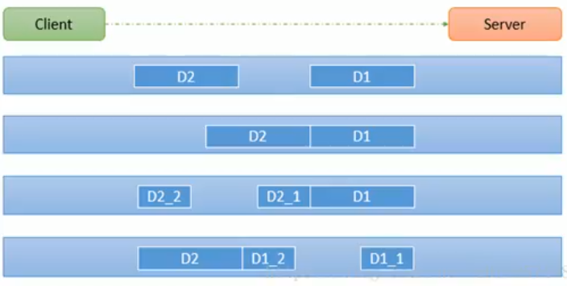

# 21_Netty_Tcp粘包拆包原理

## TCP粘包和拆包基本介绍

1. TCP是面向连接的，面向流的，提供高可靠性服务。收发两端（客户端和服务器端）都要有一一成对的Socket，因此，发送端为了将多个发给接收端的包更有效的发给对方，使用了优化方法（Nagle算法），将多次间隔较小且数据量小的数据合并成一个大的数据块，然后进行封包，这样做虽然提高了效率，但是接收端就难于分辨出完整的数据包了，因为**面向流的通信是无消息保护边界**的；

2. 由于TCP无消息保护边界，需要在接收端处理消息边界问题，也就是我们所说的粘包，拆包问题；

3. TCP粘包、拆包图解：

   

   假设客户端分别发送了两个数据包D1和D2给服务端，由于服务端一次性读取到的字节数是不确定的，所以可能存在下面几种情况：

   - 服务端分两次读取到了两个独立的数据包，分别是D1和D2，没有粘包和拆包；
   - 服务端一次性接收到了两个数据包，D1和D2粘合在一起，称之为TCP粘包；
   - 服务端分两次读取到了数据包，第一次读取到了完整的D1包和D2包的部分内容，第二次读取到了D2包的剩余内容，这称之为TCP拆包；
   - 服务端分两次读取到了数据包，第一次读取到了D1包的部分内容D1_1，第二次读取到了D1包的剩余部分内容D1_2和完整的D2包；


## TCP粘包和拆包现象实例

编写Netty程序，如果没有做处理，就会发生粘包和拆包的现象：

客户端：

```java
public class MyClient {

    public static void main(String[] args) {
        NioEventLoopGroup group = new NioEventLoopGroup(1);
        try {
            Bootstrap bootstrap = new Bootstrap();
            bootstrap.group(group)
                    .channel(NioSocketChannel.class)
                    .handler(new MyClientInitializer());
            ChannelFuture channelFuture = bootstrap.connect("localhost", 7000).sync();
            channelFuture.channel().closeFuture().sync();
        } catch (Exception e) {
            e.printStackTrace();
        } finally {
            group.shutdownGracefully();
        }

    }

}
```

```java
public class MyClientHandler extends SimpleChannelInboundHandler<ByteBuf> {

    private AtomicInteger count = new AtomicInteger(0);

    @Override
    protected void channelRead0(ChannelHandlerContext ctx, ByteBuf msg) throws Exception {
        byte[] buffer = new byte[msg.readableBytes()];
        msg.readBytes(buffer);
        String msgStr = new String(buffer, Charset.forName("utf-8"));
        System.out.println("客户端接收到消息：" + msgStr);
        System.out.println("客户端接收到消息量：" + count.incrementAndGet());
    }

    @Override
    public void exceptionCaught(ChannelHandlerContext ctx, Throwable cause) throws Exception {
        cause.printStackTrace();
        ctx.close();
    }

    @Override
    public void channelActive(ChannelHandlerContext ctx) throws Exception {
        // 使用客户端发送10条数据
        for (int i = 0; i < 10; i++) {
            ByteBuf buffer = Unpooled.copiedBuffer("hello,server" + i, CharsetUtil.UTF_8);
            ctx.writeAndFlush(buffer);
        }
    }
}
```

```java
public class MyClientInitializer extends ChannelInitializer<SocketChannel> {
    @Override
    protected void initChannel(SocketChannel ch) throws Exception {
        ch.pipeline().addLast(new MyClientHandler());
    }
}
```

服务器端：

```java
public class MyServer {

    public static void main(String[] args) {
        NioEventLoopGroup bossGroup = new NioEventLoopGroup(1);
        NioEventLoopGroup workerGroup = new NioEventLoopGroup(8);
        try {
            ServerBootstrap serverBootstrap = new ServerBootstrap();
            serverBootstrap.group(bossGroup, workerGroup)
                    .channel(NioServerSocketChannel.class)
                    .childHandler(new MyServerInitializer());
            ChannelFuture channelFuture = serverBootstrap.bind(7000).sync();
            channelFuture.channel().closeFuture().sync();
        } catch (Exception e) {
            e.printStackTrace();
        } finally {
            bossGroup.shutdownGracefully();
            workerGroup.shutdownGracefully();
        }


    }

}
```

```java
public class MyServerHandler extends SimpleChannelInboundHandler<ByteBuf> {

    private AtomicInteger count = new AtomicInteger(0);

    @Override
    protected void channelRead0(ChannelHandlerContext ctx, ByteBuf msg) throws Exception {
        // msg->byteArr
        byte[] buffer = new byte[msg.readableBytes()];
        msg.readBytes(buffer);
        // 将buffer转字符串
        String msgStr = new String(buffer, Charset.forName("utf-8"));
        System.out.println("服务器接收到数据：" + msgStr);
        System.out.println("服务器接收到消息量 = " + count.incrementAndGet());
        // 服务器回送数据给客户端，回送随机id
        ByteBuf responseByteBuf = Unpooled.copiedBuffer(UUID.randomUUID().toString(), Charset.forName("utf-8"));
        ctx.writeAndFlush(responseByteBuf);
    }

    @Override
    public void exceptionCaught(ChannelHandlerContext ctx, Throwable cause) throws Exception {
        cause.printStackTrace();
        ctx.close();
    }
}
```

```java
public class MyServerInitializer extends ChannelInitializer<SocketChannel> {
    @Override
    protected void initChannel(SocketChannel ch) throws Exception {
        ch.pipeline()
                .addLast(new MyServerHandler());
    }
}
```


现象：

多启动几个客户端会发现出现粘包以及拆包问题，这会影响正常的业务逻辑，比如代码中是向客户端回送一个UUID，但是如果发生粘包、拆包的情况，会导致发送多个UUID到客户端，与实际的业务逻辑不符合；


## TCP粘包和拆包解决方案

1. 使用**自定义协议+编解码器**来解决
2. 关键就是要解决**服务端每次读取长度**的问题，这个问题如果解决，就不会出现服务器多读或者少读数据的问题，从而避免了TCP粘包、拆包；

具体实例：

1. 要求客户端发送5个Message对象，客户端每次发送一个Message对象；
2. 服务器每次接收一个Message，分5次解码，每读到一个Message，就会回复一个Message对象给客户端；
3. 


