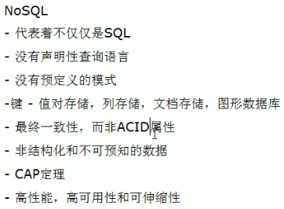
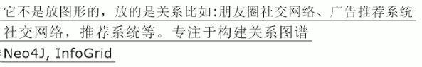
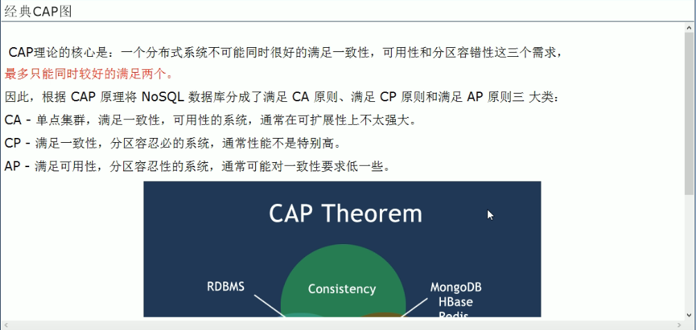
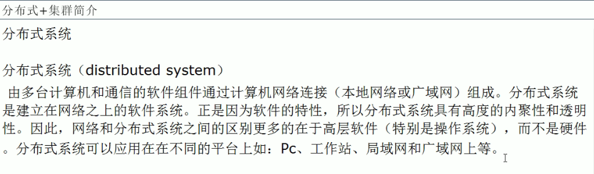

---

2019-08-06 09:02:06

---

# 01_Redis_NoSQL入门概述

## 入门概述

### 1、互联网时代背景下大机遇，为什么用nosql

1. 单机MySQL的美好年代

   在90年代,一个网站的访问量并不大，用单个数据库完全可以轻松应付。

   在那个时候，更多的都是静态网页，动态交互类型的网站不多。

   

   上述架构下，我们来看看数据存储的瓶颈是什么？

   - 数据量的总大小，一个机器放不下的时候。
   - 数据的索引（B+Tree），一个机器的内存放不下的时候。
   - 访问量（读写混合），一个实例不能承受的时候。

2. Memcached(缓存)+MySQL+垂直拆分

   

3. MySQL主从读写分离

   

4. 分表分库+水平拆分+MySQL集群

   

   

5. MySQL的扩展性瓶颈

   

6. 今天是什么样子??

   

   

7. 为什么用NoSQL

   

### 2、是什么

### 3、能干嘛

1. 易扩展

   

2. 大数据量高性能

   

3. 多样灵活的数据模型

   

4. 传统RDBMS VS NOSQL

   

   

### 4、去哪下

1. Redis
2. Memcache
3. Mongdb

### 5、怎么玩

1. KV
2. Cache
3. Persistence
4. ......

## 3V+3高

### 1、大数据时代的3V

1. 海量Volume
2. 多样Variety
3. 实时Velocity

### 2、互联网需求的3高

1. 高并发
2. 高可扩
3. 高性能

## 当下的NoSQL经典应用

当下的应用是sql和NoSQL一起使用

### 阿里巴巴中文站商品信息如何存放

#### 看看阿里巴巴中文网站首页，以女装/女包包为例

##### 架构发展历程

1. 演变历程

   

   

2. 第5代

   

3. 第5代架构使命

   

4. ......

##### 和我们相关的，多数据源多数据类型的存储问题

#### 淘宝商品

1. 商品基本信息

   名称、价格、出厂日期、生产厂商等。

   关系型数据库，MySQL/Oracle目前淘宝在去O化（也就是拿掉Oracle），**注意，淘宝内部用的MySQL是里面的大牛自己改造过的**；

   - 为什么去IOE

     

2. 商品描述、详情、评价信息（多文字类）

   多文字信息描述类，IO读写性能变差，存在文档数据库MongDB中。

3. 商品的图片

   商品图片展示类，在分布式的文件系统中：

   - 淘宝自己的TFS
   - Google的GFS
   - Hadoop的HDFS

4. 商品的关键字

   搜索引擎，淘宝内部使用ISearch

5. 商品的波段性的热点高频信息

   内存数据库：Tair，Redis、Memcache

6. 商品的交易、价格计算、积分累计

   外部系统，外部第三方支付接口，支付宝

7. 总结大型互联网应用（大数据、高并发、多样数据类型）的难点和解决方案

   - 难点

     - 数据类型的多样性
     - 数据源多样性和变化重构
     - 数据源改造而数据服务平台不需要大面积重构

   - 解决办法

     EAI和统一数据平台服务层，阿里淘宝UDSL

     类似面向接口编程，提供一个接口去操作多个数据源，统一数据平台服务层。

     **UDSL：**

     - 是什么

       

       

     - 什么样

       

       1. 映射

          

          

       2. API

          

          

       3. 热点缓存

          

          

       4. ......

## NoSQL数据模型简介

### 以一个电商客户、订单、订购、地址模型来对比下关系型数据库和非关系型数据库

1. 传统的关系型数据库你如何设计？

   - E-R图（1:1/1:N/N:N，主外键等）

     

   - NoSQL如何设计

     - 什么是BSON

       BSON()是一种类JSON的一种二进制形式的存储格式，简称Binary JSON，和JSON一样支持内嵌的文档对象和数组对象。

       

       

       

     - 两者对比，问题和难点

       - 为什么上述的情况可以用聚合模型来处理

         高并发的操作是不太建议有关联查询的，互联网公司用冗余数据来避免关联查询，分布式事务是支持不了太多的并发的。

       - 关系模型数据库如何查？按照BSON查询

### 聚合模型

1. KV键值对

2. BSON

3. 列族

   顾名思义，是按列存储数据的。最大的特点是方便存储结构化和半结构化数据，方便做数据压缩，对针对某一列或者某几列的查询有非常大的IO优势。

   

4. 图族

   

   

## NoSQL数据库的四大分类

### KV键值：典型介绍

1. 新浪：BerkeleyDB+redis
2. 美团：redis+tair
3. 阿里、百度：memcache+redis

### 文档型数据库（bson格式比较多）：典型介绍

1. CouchDB

2. MongoDB

   MongoDB是一个**基于分布式文件存储的数据库**，由C++语言编写，旨在为WEB应用提供可扩展的高性能数据存储解决方案。

   MongoDB是一个介于关系数据库和非关系数据库之间的产品，是非关系型数据库当中功能最丰富，最像关系型数据库的。

### 列存储数据库

Cassandra，HBase，分布式文件系统

### 图关系数据库

### 四者对比

## 在分布式数据库中CAP原理CAP+BASE

### 传统的ACID分别是什么

### CAP

### CAP的3进2

### 经典CAP图

### BASE

### 分布式+集群简介

