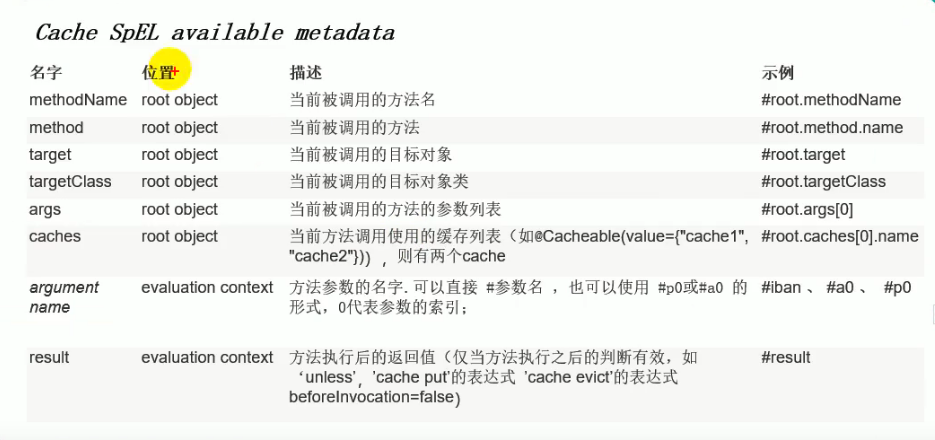

---
2019-07-31 17:21:01
---


几个属性：

1. cacheNames/value：指定缓存组件的名字；将方法的返回结果放在哪个缓存组件中；是数组的形式，所以可以放到多个缓存中

2. key：缓存数据使用的key，可以用key来指定，而默认是使用方法的参数值
   还可以使用SpEL表达式来写：

   

   比如想要写出getEmp[2]的效果，可以用`key="#root.methodName+'['+#id+']'"`

3. keyGenerator：key的生成器，可以指定自己的key生成器组件**（key和keyGenerator二选一）**

   自己写一个KeyGenerator

   ```java
   @Configuration
   public class MyCacheConfig {
   
       @Bean("myKeyGenerator")
       public KeyGenerator keyGenerator(){
           KeyGenerator keyGenerator = new KeyGenerator() {
   
               @Override
               public Object generate(Object target, Method method, Object... params) {
                   return method.getName()+"["+ Arrays.asList(params).toString()+"]";
               }
           };
           return keyGenerator;
       }
   
   }
   ```

   然后再到方法上指明用这个KeyGenerator；

   ```java
   @RestController
   public class EmployeeController {
   
       @Autowired
       private EmployeeService employeeService;
   
       @GetMapping("/emp/{id}")
       @Cacheable(cacheNames = "emp",keyGenerator = "myKeyGenerator")
       public Employee getEmployee(@PathVariable("id") Integer id){
           Employee emp = employeeService.getEmp(id);
           return emp;
       }
   }
   ```

4. cacheManager：指定缓存管理器；后期整合其他缓存进来的时候用到；

5. cacheResolver：指定获取解析器，跟上面的cacheManager一样，二选一使用。

6. condition：指定符合条件的情况下才进行缓存，condition="#id==0"或者condition="#a0>0 and #root.methodName eq 'aaa'"。

7. unless：否定缓存，除非；如果是true的情况就不缓存，跟condition相反。

8. sync：是否使用异步模式，使用异步，则**不支持unless**。

