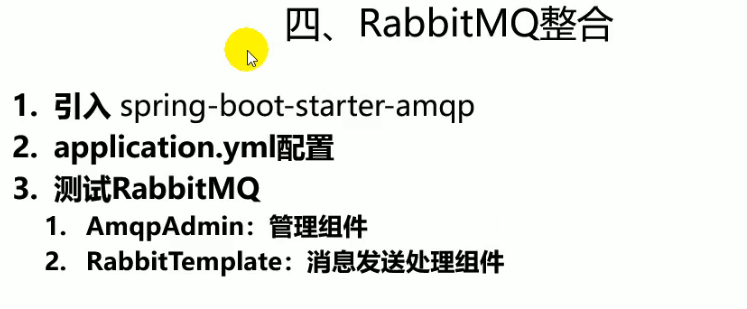
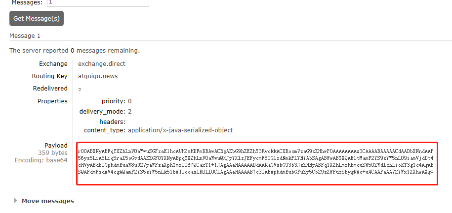
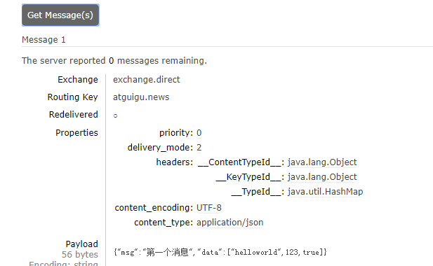

---
2019-08-02 09:40:48

---




还是用1.5的SpringBoot版本


创建新的SpringBoot项目，引入rabbitMQ，lombok;

直接搜索RabbitAutoConfiguration类，查看配置了哪些东西。

自动配置：

1. RabbitAutoConfiguration自动配置类

2. 自动配置了CachingConnectionFactory连接工厂，连接信息从RabbitProperties（以spring.rabbitmq为前缀）中得到；

3. RabbitProperties封装了RabbitMQ的所有配置。

   - 可在配置文件中修改：

     ```properties
     spring.rabbitmq.host:tomxwd.top
     spring.rabbitmq.port=12387
     spring.rabbitmq.username=guest
     spring.rabbitmq.password=guest
     # spring.rabbitmq.virtual-host=/
     ```

4. 注入RabbitTemplate：给rabbitmq发送和接收消息。

5. 注入AmqpAdmin：RabbitMQ系统管理功能组件，可以声明队列，交换机等功能。

6. 测试：

   - 在测试类中自动注入RabbitTemplate

   - send(exchange,routeKey,message); 这种形式需要自己去构造一个Message，定义消息头和消息内容

   - convertAndSend(exchang,routeKey,object);这种比较常用，只要传入发送对象，会自动序列化发送给rabbitMQ；

   - **点对点测试：**

     ```java
     /**
          * 单播：点对点
          */
     @Test
     public void contextLoads() {
     
         // message需要自己构造一个;定义消息体内容和消息头
         // template.send(exchange,routeKey,message);
         // object默认当成消息体，我们只需要传入要发送的对象，自动序列化发送给rabbitMQ
         //        template.convertAndSend(exchang,routeKey,object);
         Map<String,Object> map = new HashMap<String,Object>();
         map.put("msg","第一个消息");
         map.put("data", Arrays.asList("helloworld",123,true));
         // 对象被默认序列化以后发送出去
         template.convertAndSend("exchange.direct","atiguigu.news",map);
     
     }
     ```

   - 

     默认是使用java的序列化方式传输。

   - 接收数据测试：

     ```java
     @Test
     public void testRecive(){
         Object o = template.receiveAndConvert("atguigu.news");
         System.out.println("o.getClass() = " + o.getClass());
         System.out.println(o);
     }
     ```

7. 如何将数据序列化为json传输？

   - RabbitTemplate默认的MessageConverter是用SimpleMessageConvert的，而SimpleMessageConvert就是用JDK的序列化机制完成序列化操作的。

   - 定义自己的MessageConverter并注入容器：

     ```java
     @Configuration
     public class MyAMQPConfig {
     
         //注意导入的是org.springframework.amqp.support.converter.MessageConverter;
         @Bean
         public MessageConverter messageConverter(){
             return new Jackson2JsonMessageConverter();
         }
     
     }
     ```

   - 

   - 可以看到消息头的内容，消息体的内容是json类型。

8. 测试用对象传输的结果：

   - 创建一个bean（Book）：

     ```java
     @Data
     @AllArgsConstructor
     @RequiredArgsConstructor
     public class Book {
     
         private String bookName;
         private String author;
     
     
     }
     ```

   - 测试：

     ```java
     @Test
     public void testBookSend(){
         Book book = new Book("书名", "作者");
         template.convertAndSend("exchange.direct","atguigu",book);
     }
     
     @Test
     public void testBookRecive(){
         Object o = template.receiveAndConvert("atguigu");
         System.out.println(o.getClass());
         System.out.println("o = " + o);
     }
     ```

9. 测试广播（fanout）：

   ```java
   @Test
   public void testFanout(){
       template.convertAndSend("exchang.fanout","",new Book("三国演义","罗贯中"));
   }
   ```