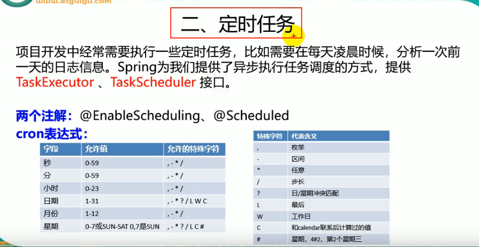
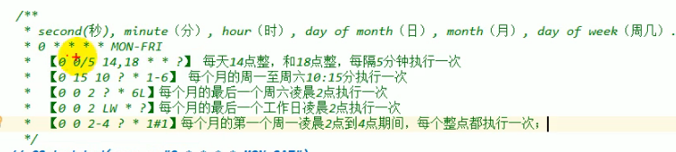

---
2019-08-14 09:22:29

---




```
 第一位，表示秒，取值0-59 
 第二位，表示分，取值0-59 
 第三位，表示小时，取值0-23 
 第四位，日期天/日，取值1-31 
 第五位，日期月份，取值1-12 
 第六位，星期，取值1-7，星期1..... 
 第7为，年份，可以留空，取值1970-2099 
(*)星号：可以理解为每的意思，每秒，每分，每天，每月，每年... 
(?)问号：问号只能出现在日期和星期这两个位置，表示这个位置的值不确定，每天3点执行，所以第六位星期的位置，我们是不需要关注的，就是不确定的值。同时：日期和星期是两个相互排斥的元素，通过问号来表明不指定值。比如，1月10日，比如是星期1，如果在星期的位置是另指定星期二，就前后冲突矛盾了。 
(-)减号：表达一个范围，如在小时字段中使用“10-12”，则表示从10到12点，即10,11,12 
(,)逗号：表达一个列表值，如在星期字段中使用“1,2,4”，则表示星期一，星期二，星期四 
(/)斜杠：如：x/y，x是开始值，y是步长，比如在第一位（秒） 0/15就是，从0秒开始，每15秒，最后就是0，15，30，45，60 另：*/y，等同于0/y 
```



Service:

```java
@Service
public class ScheduledService {

    /**
     * second(秒),minute(分),hour(时),day(日),month(月),week(周几)
     * 0 * * * * MON-FRI
     */
    @Scheduled(cron = "0 * * * * WED")
    public void hello(){
        System.out.println("hello...");
    }

    /**
     * 枚举
     */
    @Scheduled(cron = "0,1,2,3,4,5 * * * * WED")
    public void hello2(){
        System.out.println("hello2...");
    }

    /**
     * 区间-
     */
    @Scheduled(cron = "6-10 * * * * WED")
    public void hello3(){
        System.out.println("hello3...");
    }

    /**
     * 步长/
     * 一秒开始每四秒执行一次
     */
    @Scheduled(cron = "1/4 * * * * WED")
    public void hello4(){
        System.out.println("hello4...");
    }

}
```

SpringBoot配置类：

```java
@SpringBootApplication
// 开启异步
@EnableAsync
// 开启定时
@EnableScheduling
public class Springboot04TaskApplication {

    public static void main(String[] args) {
        SpringApplication.run(Springboot04TaskApplication.class, args);
    }

}
```

