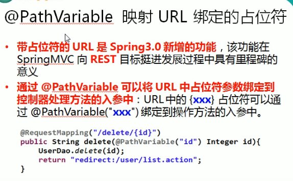

---
2019-07-24 17:02:12
---





```java
/**
* @PathVariable 可以来映射URL中的占位符到目标方法的参数中
* @param id
* @return
*/    
@RequestMapping("/pathVariable/{id}")
public String testPathVariable(@PathVariable(value = "id") Integer id){
    System.out.println("RequestMethodController.testPathVariable"+id);
    return SUCCESS;
}
```

