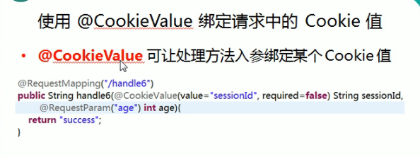

---
2019-07-25 09:58:16

---


1. 

2. ```java
   /**
        * 了解：
        * @CookieValue：映射一个Cookie值
        * 属性同@RequestParam
        * @param sessionId
        * @return
   */
   @RequestMapping("/cookie")
   public String cookie(@CookieValue("JSESSIONID") String sessionId){
       System.out.println("RequestMethodController.cookie sessionId: "+sessionId);
       return SUCCESS;
   }
   ```

3. 

