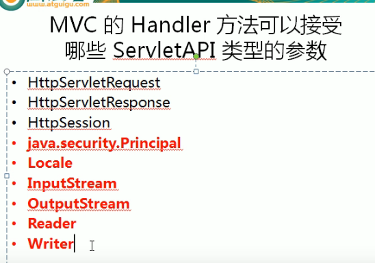

---
2019-07-25 10:17:44

---


1. 

2. 

3. ```java
   /**
        * 可以使用Servlet的原生API作为目标方法的参数
        * 具体支持以下类型
        * HttpServletRequest
        * HttpServletResponse
        * HttpSession
        * java.security.Principal
        * Locale
        * InputStream
        * OutputStream
        * Reader
        * Writer
   */
   @RequestMapping(value = "stream")
   public void testStream(Writer out, Locale local) throws IOException {
       System.out.println(local);
       out.write("hello,springmvc");
   }
   
   
   @RequestMapping(value = "servlet")
   public String testServletApi(HttpServletRequest request,
                                HttpServletResponse response){
       System.out.println(request+" "+response);
       return SUCCESS;
   }
   ```

4. 

