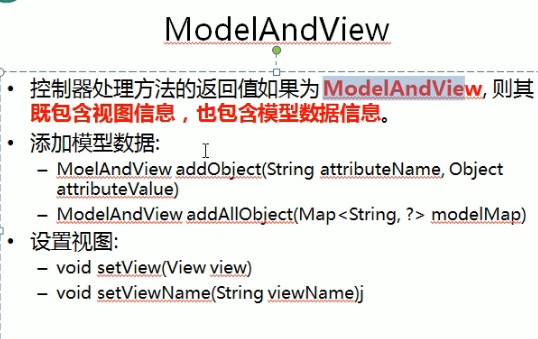

---
2019-07-25 10:28:29

---


1. 

2. 

3. ```java
   /**
        * 目标方法的返回值可以是ModelAndView类型
        * 其中可以包含视图和模型信息
        * SpringMvc会把ModelAndView的model中的数据放入到request域对象中。
        * @return
   */
   @RequestMapping("testMv")
   public ModelAndView testMv(){
       String viewName = SUCCESS;
       ModelAndView mv = new ModelAndView(viewName);
       // 添加模型数据到ModelAndView中
       mv.addObject("time",new Date());
       return mv;
   }
   ```

   
   