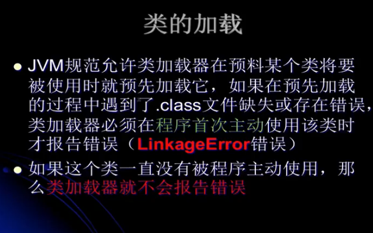

---
2019-08-21 08:37:36

---

#

自定义类加载器在复杂类加载情况下的运行分析



## 

例子：

MyTest16自定义加载器类：

```java
public class MyTest16 extends ClassLoader{

    private String classLoaderName;

    private final String fileExtension = ".class";

    private String path;

    public void setPath(String path) {
        this.path = path;
    }

    public MyTest16(String classLoaderName){
        /**
         * 使用由方法getSystemClassLoader()所返回的类加载器作为他的parentClassLoader（双亲）
         */
        super();
        this.classLoaderName = classLoaderName;
    }

    /**
     * 会使用指定的parent做为这个类加载器的双亲
     * @param parent
     * @param classLoaderName
     */
    public MyTest16(ClassLoader parent,String classLoaderName){
        super(parent);
        this.classLoaderName = classLoaderName;
    }

    @Override
    protected Class<?> findClass(String name) throws ClassNotFoundException {
        System.out.println("findClass invoked：" + name);
        System.out.println("Classloadername：" + this.classLoaderName);
        byte[] data = this.loadClassData(name);
        return this.defineClass(name,data,0,data.length);
    }

    /**
     * 这个name就是用户传进来需要被加载的类的名字（二进制名 全限定名）
     * @param name
     * @return
     */
    private byte[] loadClassData(String name){
        InputStream is = null;
        byte[] data = null;
        ByteArrayOutputStream baos = null;

        name = name.replace(".","\\");

        try{
            is = new FileInputStream(new File(this.path+name+this.fileExtension));
            baos = new ByteArrayOutputStream();
            int ch = 0;
            while (-1 != (ch=is.read())){
                baos.write(ch);
            }
            data = baos.toByteArray();
        } catch (Exception e){
            e.printStackTrace();
        } finally {
            try {
                is.close();
                baos.close();
            }catch (Exception e){
                e.printStackTrace();
            }
        }
        return data;
    }

}
```

MyCat类：

```java
public class MyCat {

    public MyCat(){
        System.out.println("MyCat is loaded by: " + this.getClass().getClassLoader());
    }

}
```

MySample类：

```java
public class MySample {

    public MySample(){
        System.out.println("MySample is loaded by: " + this.getClass().getClassLoader());
        new MyCat();
    }

}
```

MyTest17类：

```java
public class MyTest17 {

    public static void main(String[] args) throws ClassNotFoundException, IllegalAccessException, InstantiationException {
        MyTest16 loader1 = new MyTest16("loader1");
        Class<?> clazz = loader1.loadClass("top.tomxwd.classloader.MySample");
        System.out.println("clazz.hashCode() = " + clazz.hashCode());
        // 如果注释下面这行，那么不会实例化MySample对象，即MySample构造方法不会被调用
        // 因此不会实例MyCat对象，即没有对MyCat进行主动使用，这里就不会加载MyCat Class
//        Object obj = clazz.newInstance();
    }

}
```

输出：

注释掉：

```
[Loaded top.tomxwd.classloader.MyTest16 from file:/E:/IDEA-workspace/jvm-test-01/target/classes/]
[Loaded top.tomxwd.classloader.MySample from file:/E:/IDEA-workspace/jvm-test-01/target/classes/]
clazz.hashCode() = 1956725890
```

打开注释：

```
[Loaded top.tomxwd.classloader.MyTest17 from file:/E:/IDEA-workspace/jvm-test-01/target/classes/]
[Loaded top.tomxwd.classloader.MyTest16 from file:/E:/IDEA-workspace/jvm-test-01/target/classes/]
[Loaded top.tomxwd.classloader.MySample from file:/E:/IDEA-workspace/jvm-test-01/target/classes/]

clazz.hashCode() = 1956725890

MySample is loaded by: sun.misc.Launcher$AppClassLoader@58644d46

[Loaded top.tomxwd.classloader.MyCat from file:/E:/IDEA-workspace/jvm-test-01/target/classes/]

MyCat is loaded by: sun.misc.Launcher$AppClassLoader@58644d46
```

