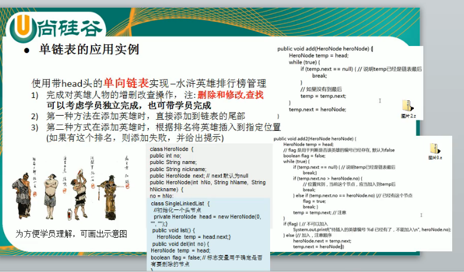
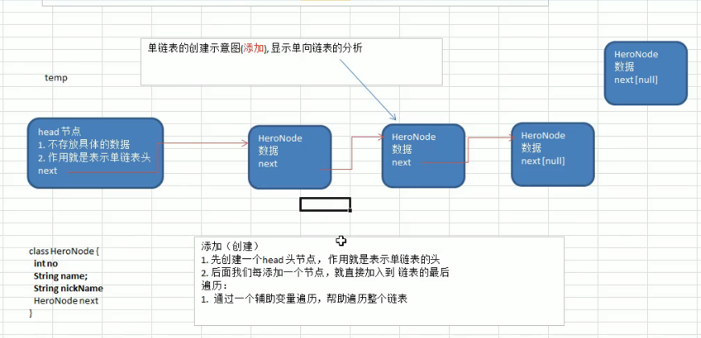

---
2019-07-26 10:14:46

---


1. 

2. 

3. ```java
   public class SingleLinkedListDemo {
   
       public static void main(String[] args) {
           SingleLinkedList linkedList = new SingleLinkedList();
           linkedList.add(new HeroNode(1,"宋江","及时雨"));
           linkedList.add(new HeroNode(2,"卢俊义","玉麒麟"));
           linkedList.add(new HeroNode(3,"吴用","智多星"));
           linkedList.add(new HeroNode(4,"林冲","豹子头"));
           linkedList.list();
       }
   
   }
   
   // 定义一个SingleLinkedList管理HeroNode
   class SingleLinkedList{
       // 定义一个头节点 ，不要动
       private HeroNode head = new HeroNode(0,"","");
   
       // 添加节点到单向链表
       // 思路，当不考虑编号顺序的时候
       // 1. 找到当前链表的最后节点
       // 2. 将最后这个节点的next域指向新的节点
       public void add(HeroNode node){
           // 因为head节点不能动，所以我们需要一个辅助遍历temp
           HeroNode temp = head;
           // 遍历，找到最后
           while(true){
               // 当temp.next=null->走到最后
               if(temp.next==null){
                   break;
               }
               // 找不到 temp后移
               temp = temp.next;
           }
           // 当退出while循环的时候，temp就指向了这个链表的最后
           temp.next = node;
       }
   
       // 显示链表
       public void list(){
           //判断是否为空
           if(head.next == null){
               System.out.println("链表为空！");
               return;
           }
           // 因为头结点不能动，所以需要一个辅助变量来遍历
           HeroNode temp = head.next;
           while(true){
               if(temp==null){
                   break;
               }
               System.out.println(temp);
               temp = temp.next;
           }
       }
   
   }
   
   // 定义一个HeroNode,每一个HeroNode对象就是一个节点
   class HeroNode{
       public int no;
       public String name;
       public String nickName;
       public HeroNode next;//指向下一个节点
   
       // 构造器
       public HeroNode(int no, String name, String nickName) {
           this.no = no;
           this.name = name;
           this.nickName = nickName;
       }
   
       @Override
       public String toString() {
           return "HeroNode{" +
                   "no=" + no +
                   ", name='" + name + '\'' +
                   ", nickName='" + nickName + '\'' +
                   '}';
       }
   }
   ```

   

