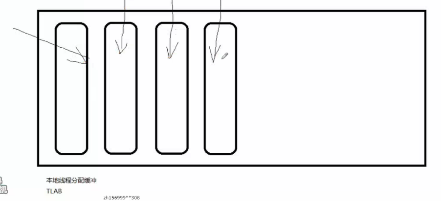

---
2019-08-02 16:13:39

---

给对象分配内存

指针引用的一个过程

- 指针碰撞
- 空闲列表

以上两种方式，取决于垃圾收集器是否带有压缩整理的功能，把内存区域划分为规整的区域，可以使用指针碰撞，如果没有，就不能使用指针碰撞。

线程安全性问题

- 线程同步（效率低）

- 本地线程分配缓冲：针对每个线程分配一块区域，称之为**【本地线程分配缓冲】**（Thread Local Allocation Buffer）（TLAB）

  

  如果占满了，就再分配一块区域，这时候是同步的策略。

  

初始化对象

执行构造方法（包括代码块等） 