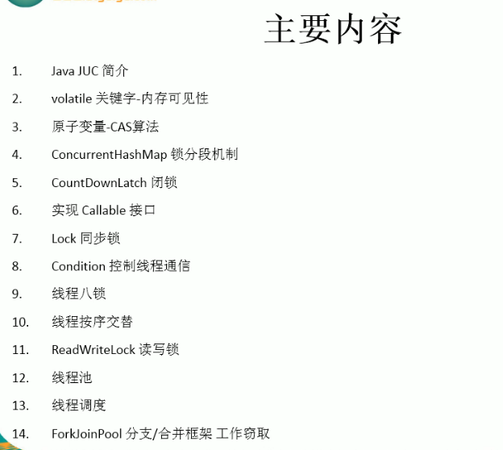
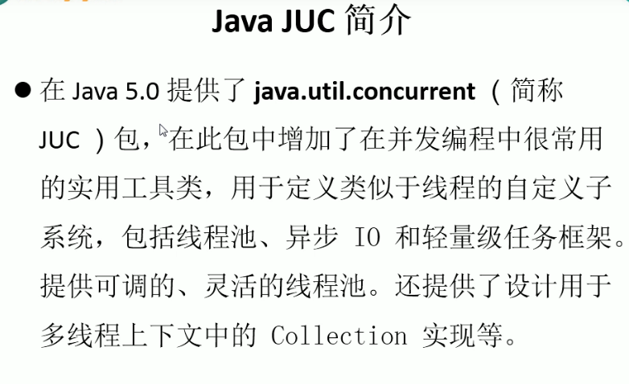
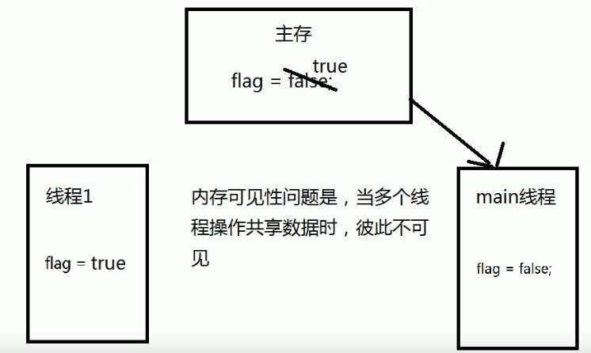

---
2019-08-26 09:55:09

---

#









内存可见性问题就是当多个线程操作共享数据的时候，彼此不可见，因此产生此问题。

对于上述问题可以用synchronized来锁，但是效率低，多线程的情况下会造成阻塞。

```java
public class TestVolatile {

    public static void main(String[] args) {
        ThreadDemo td = new ThreadDemo();
        new Thread(td).start();
        while (true){
            // 锁确实可以保证数据的即时更新，但是效率非常低，在多线程的时候没获得锁会造成阻塞
            synchronized (td){
                // 这里如果不进行同步synchronized，会发现并不会打印，这里的flag是false的
                if(td.isFlag()){
                    System.out.println("--------------");
                    break;
                }
            }
        }
    }

}

class ThreadDemo implements Runnable{

    public boolean isFlag() {
        return flag;
    }

    public void run() {
        try {
            Thread.sleep(200);
        } catch (InterruptedException e) {
            e.printStackTrace();
        }
        flag = true;
        System.out.println("flag = " + flag);
    }

    public void setFlag(boolean flag) {
        this.flag = flag;
    }

    private boolean flag = false;
}
```

这时候就需要volatile关键字，当多个线程进行操作共享数据时，可以保证内存中的数据是可见的。底层是用计算机底层的代码内存栅栏，实际上是时时刻刻把缓存中的数据刷新到主存。相当于线程每次进行操作共享数据的时候，就像在主存中操作一样。

虽然使用volatile关键字效率也会降低（数据实时更新到主存，且JVM底层有个优化叫重排序，volatile修饰了以后，就不能重排序了），但是相比锁而言，volatile效率会高一些。

```java
public class TestVolatile {

    public static void main(String[] args) {
        ThreadDemo td = new ThreadDemo();
        new Thread(td).start();
        while (true){
            if(td.isFlag()){
                System.out.println("--------------");
                break;
            }
        }
    }

}

class ThreadDemo implements Runnable{

    private volatile boolean flag = false;

    public boolean isFlag() {
        return flag;
    }

    public void run() {
        try {
            Thread.sleep(200);
        } catch (InterruptedException e) {
            e.printStackTrace();
        }
        flag = true;
        System.out.println("flag = " + flag);
    }

    public void setFlag(boolean flag) {
        this.flag = flag;
    }
}
```

相较于synchronized是一种较为轻量级的同步策略，但是使用volatile的时候还是要注意：

1. volatile不具备”互斥性“；
2. volatile不能保证变量的“原子性”；
3. 