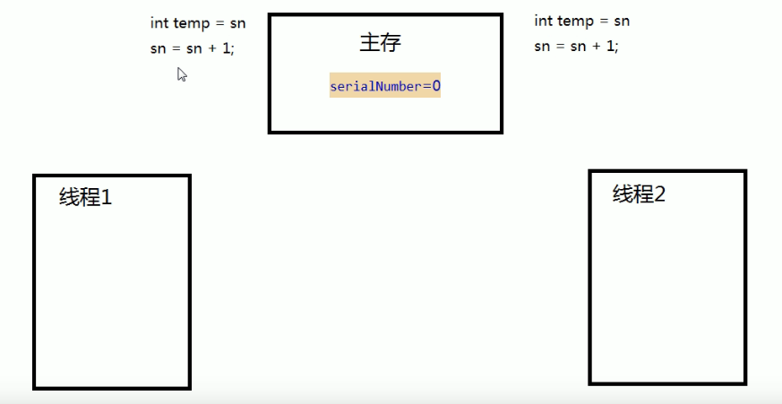

---
2019-08-26 10:25:04

---

#

考虑i++的原子性问题

i++的操作实际上分为三个步骤“读-改-写”；

```java
int i = 10;
i = i++;
```

底层：

```java
int temp = i;
i = i+1;
i = temp;
```

编写代码测试原子性：

```java
public class TestAtomicDemo {

    public static void main(String[] args) {
        AtomicDemo ad = new AtomicDemo();
        for (int i = 0; i < 10; i++) {
            new Thread(ad).start();
        }
    }


}

class AtomicDemo implements Runnable{

    private int serialNumber = 0;

    public void run() {
        try {
            Thread.sleep(200);
        } catch (InterruptedException e) {
            e.printStackTrace();
        }
        System.out.println(Thread.currentThread().getName() + ":" + getSerialNumber());
    }

    public int getSerialNumber(){
        return serialNumber++;
    }
}
```

输出：

这里多运行几次，可能才出现。

```
Thread-2:0
Thread-4:2
Thread-5:3
Thread-7:1
Thread-6:7
Thread-3:0
Thread-1:6
Thread-8:5
Thread-0:4
Thread-9:8
```

发现有两个0；




而想当然的就想到可以用volatile来解决，但是volatile结局了内存可见性，但不保证原子性，所以依然还会存在这种问题（因为i++这种操作包含了读改写三步操作）；

原子变量：jdk1.5以后提供了java.util.concurrent.atomic包下提供了大量常用的原子变量；

- 原子变量包含了volatile的特性，保证了内存可见性。

- 用CAS（Compare-And-Swap）算法保证数据的原子性

  CAS算法是硬件对于并发操作共享数据的支持（计算机底层的知识）

  

  CAS包含了三个操作数：

  - 内存值V
  - 预估值A
  - 更新值B
  - 当且仅当V == A时，V = B，否则将不做任何操作

  CAS比加锁效率高，因为CAS算法在不成功的时候不会阻塞，不会放弃CPU给他的使用权，紧接着可以立即再去尝试更新，所以比同步锁的效率高很多。

  用原子变量改进代码：

  ```java
  public class TestAtomicDemo {
  
      public static void main(String[] args) {
          AtomicDemo ad = new AtomicDemo();
          for (int i = 0; i < 10; i++) {
              new Thread(ad).start();
          }
      }
  
  
  }
  
  class AtomicDemo implements Runnable{
  
  //    private int serialNumber = 0;
  
      /**
       * 使用原子变量
       */
      private AtomicInteger serialNumber = new AtomicInteger();
  
      public void run() {
          try {
              Thread.sleep(200);
          } catch (InterruptedException e) {
              e.printStackTrace();
          }
          System.out.println(Thread.currentThread().getName() + ":" + getSerialNumber());
      }
  
      public int getSerialNumber(){
  //        ++i
  //        serialNumber.incrementAndGet();
          // i++
          return serialNumber.getAndIncrement();
      }
  }
  ```

  执行结果没问题，不会再出现重复数字。


