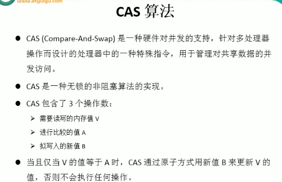

---
2019-08-26 11:23:36

---

#




模拟CAS算法：

```java
/**
 * 模拟CAS算法
 */
public class TestCompareAndSwap {

    public static void main(String[] args) {
        final CompareAndSwap cas = new CompareAndSwap();
        for (int i = 0; i < 10; i++) {
            new Thread(new Runnable() {
                public void run() {
                    int expectedValue = cas.getValue();
                    int newValue = (int)(Math.random()*100);
                    boolean b = cas.compareAndSet(expectedValue, newValue);
                    System.out.println(Thread.currentThread().getName()+" : "+b);
                }
            }).start();
        }
    }

}

class CompareAndSwap{
    private int value;

    /**
     * 获取内存值
     * @return
     */
    public synchronized int getValue(){
        return value;
    }

    /**
     * 比较
     * @param expectedValue
     * @param newValue
     * @return
     */
    public synchronized int comparedAndSwap(int expectedValue,int newValue){
        int oldValue = value;
        if(oldValue == expectedValue){
            this.value = newValue;
        }
        return oldValue;
    }

    /**
     * 设置
     * @param expectedValue
     * @param newValue
     * @return
     */
    public synchronized boolean compareAndSet(int expectedValue,int newValue){
        return expectedValue == comparedAndSwap(expectedValue,newValue);
    }

}
```

输出：

```
Thread-0 : true
Thread-1 : false
Thread-3 : false
Thread-5 : true
Thread-4 : true
Thread-2 : false
Thread-8 : true
Thread-7 : true
Thread-6 : true
Thread-9 : true
```

