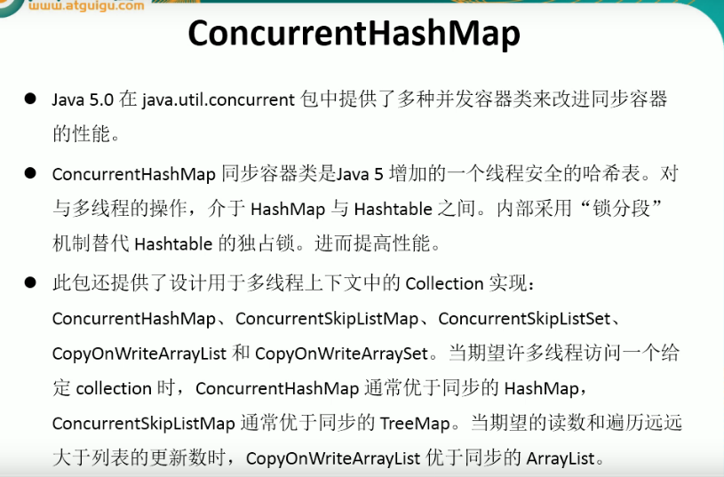
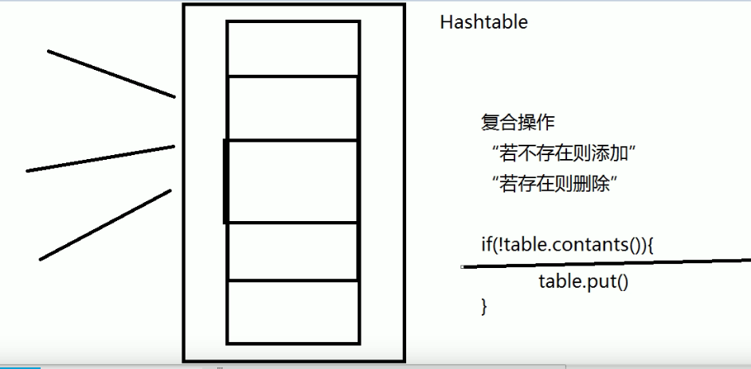
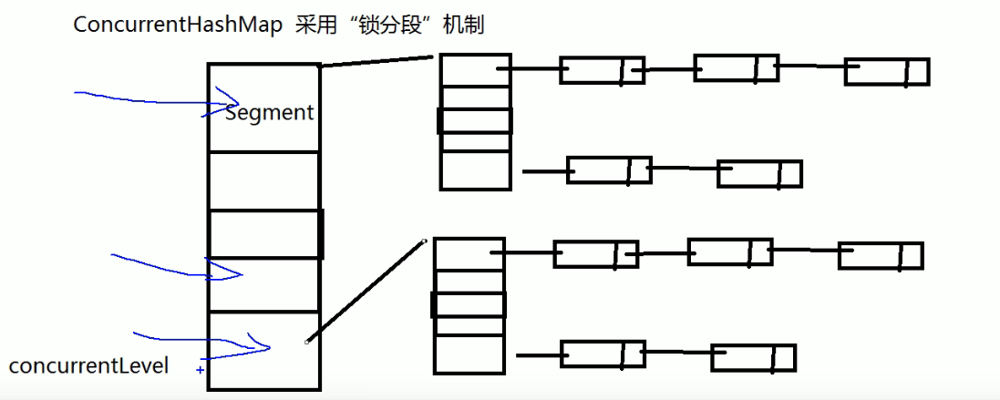

---
2019-08-26 13:50:40

---

#

锁分段机制



Hashtable线程安全，但是他是用锁整个对象的方式来保证的。



所以效率非常低，基本不使用，而且又存在复合操作上的安全问题（“若不存在则添加”，“若存在则删除”）。

复合操作：

```java
if(!table.contains()){
    table.put()
}
```

虽然说对于操作Hashtable是锁了整个table，但是由于线程可能都执行到!table.contains()这句，所以还是存在线程不安全的问题。

因此jdk5之后引入了支持并发的各种容器类，这里用的比较多、比较好的是ConcurrentHashMap。

ConcurrentHashMap采用的是“锁分段”机制。



concurrentLevel默认分为16个段Segment，每个段中默认也有16个段，每个段中又有一个个链表。

那么锁分段意味着在并发的环境下，支持多个线程同时访问ConcurrentHashMap，根据锁的Segment不同，达到并行的效果，效率大大提高。

而且ConcurrentHashMap还提供了一些复合操作的方法。

用Collections.synchronizedMap()等方法转的集合，只是将其所有的方法都加了synchronized关键字。

**JDK1.8取消了分段锁机制，改用CAS（无锁算法，不阻塞，不涉及上下文切换的问题，效率相对高）。**


##

CopyOnWriteArrayList/CopyOnWriteArraySet : 写入并复制，每次写入时都会在底层完成一个复制，复制一个新的列表然后再进行添加。虽然线程安全了，但是效率低，所以添加操作多的并不适用，适用于迭代操作多的情况。

```java
/**
 * CopyOnWriteArrayList/CopyOnWriteArraySet : 写入并复制
 * 注意：添加操作多时，效率会低，因为每次添加都会进行复制，开销非常大
 * 并发迭代多时，可以选择，能够提高效率
 */
public class TestCopyOnWriteArrayList {

    public static void main(String[] args) {
        HelloThread ht = new HelloThread();
        for (int i = 0; i < 10; i++) {
            new Thread(ht).start();
        }
    }

}

class HelloThread implements Runnable{

//    private static List<String> list = Collections.synchronizedList(new ArrayList<String>());

    private static CopyOnWriteArrayList<String> list = new CopyOnWriteArrayList<String>();

    static {
        list.add("AA");
        list.add("BB");
        list.add("CC");
    }

    public void run() {
        Iterator<String> it = list.iterator();
        while (it.hasNext()){
            System.out.println(it.next());
            list.add("AA");
        }
    }
}
```

