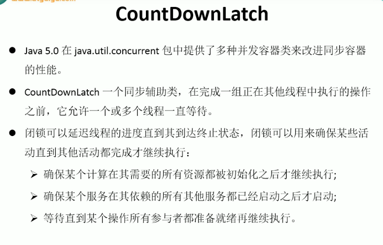

---
2019-08-26 14:22:10

---

#

CountDownLatch闭锁



闭锁，在完成某些运算时，只有其他线程的运算全部完成，当前运算才继续执行；

下面的需求是当所有线程执行完，计算总时间：

代码：

```java
/**
 * TestCountDownLatch：闭锁，在完成某些运算时，只有其他线程的运算全部完成，当前运算才继续执行
 */
public class TestCountDownLatch {

    public static void main(String[] args) {
        final CountDownLatch latch = new CountDownLatch(5);
        LatchDemo ld = new LatchDemo(latch);
        long start = System.currentTimeMillis();
        for (int i = 0; i < 5; i++) {
            new Thread(ld).start();
        }
        try {
            latch.await();
        } catch (InterruptedException e) {
            e.printStackTrace();
        }
        long end = System.currentTimeMillis();
        System.out.println("耗费时间为："+(end-start));
    }

}

class LatchDemo implements Runnable{

    private CountDownLatch latch;

    public LatchDemo(CountDownLatch latch){
        this.latch = latch;
    }

    public void run() {

        synchronized (this) {
            try {
                for (int i = 0; i < 50000; i++) {
                    if(i%2==0){
                        System.out.println("i = " + i);
                    }
                }
            } finally {
                latch.countDown();
            }
        }
    }
}
```


