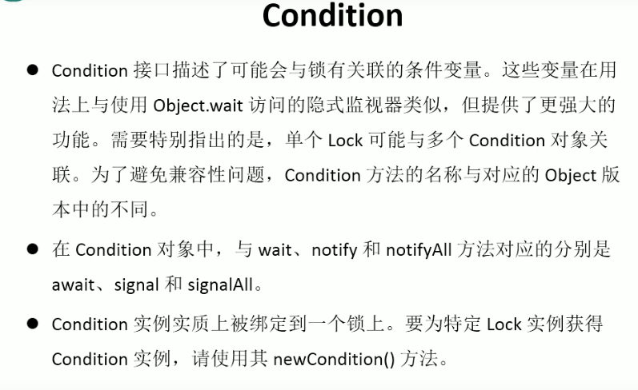

---
2019-08-26 16:34:16

---

#

改造之前用synchronized的方法，改用同步锁Lock来实现，而Lock有自己的wait方式，就是Condition；



```java
import java.util.concurrent.locks.Condition;
import java.util.concurrent.locks.Lock;
import java.util.concurrent.locks.ReentrantLock;

/**
 * 生产者和消费者案例
 */
public class TestProductorAndConsumerForLock {

    public static void main(String[] args) {
        Clerk clerk = new Clerk();
        Productor productor = new Productor(clerk);
        Consumer consumer = new Consumer(clerk);
        new Thread(productor,"生产者A").start();
        new Thread(consumer,"消费者B").start();
        new Thread(productor,"生产者C").start();
        new Thread(consumer,"消费者D").start();
    }

}

/**
 * 店员
 */
class Clerk{

    private int product = 0;

    private Lock lock = new ReentrantLock();

    private Condition condition = lock.newCondition();

    // 进货
    public void get(){
        lock.lock();
        try {
            while (product>=1){
                System.out.println("产品已满！");
                try {
                    condition.await();
                } catch (InterruptedException e) {
                    e.printStackTrace();
                }
            }
            System.out.println(Thread.currentThread().getName()+":"+(++product));
            condition.signalAll();
        } finally {
            lock.unlock();
        }
    }

    // 卖货
    public void sale(){
        lock.lock();
        try {
            while(product<=0){
                System.out.println("缺货！");
                try {
                    condition.await();
                } catch (InterruptedException e) {
                    e.printStackTrace();
                }
            }
            System.out.println(Thread.currentThread().getName()+":"+(product--));
            condition.signalAll();
        } finally {
            lock.unlock();
        }
    }

}

/**
 * 生产者
 */
class Productor implements Runnable{
    private Clerk clerk;

    public Productor(Clerk clerk){
        this.clerk = clerk;
    }

    public void run() {
        for (int i = 0; i < 20; i++) {
            try {
                Thread.sleep(200);
            } catch (InterruptedException e) {
                e.printStackTrace();
            }
            clerk.get();
        }
    }
}

/**
 * 消费者
 */
class Consumer implements Runnable{

    private Clerk clerk;

    public Consumer(Clerk clerk) {
        this.clerk = clerk;
    }

    public void run() {
        for (int i = 0; i < 20; i++) {
            clerk.sale();
        }
    }
}
```


