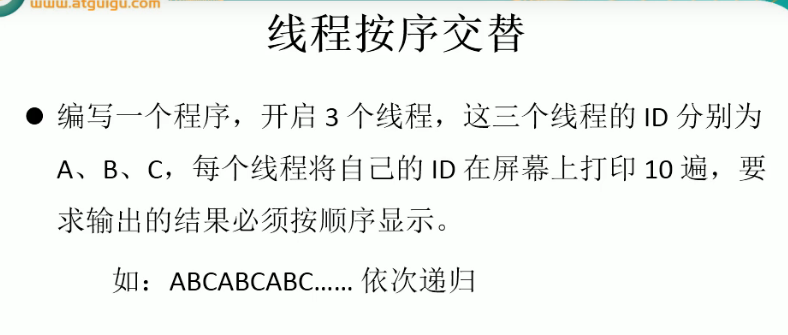

---
2019-08-26 16:42:48

---

#



```java
/**
 * 编写一个程序，开3个线程，三个线程的ID分别是A、B、C，每个线程将自己的ID在屏幕上打印20遍，要求输出结果必须按顺序显示
 * 如 ABCABCABC...
 */
public class TestABCAlternate {

    public static void main(String[] args) {
        final AlternateDemo ad = new AlternateDemo();
        new Thread(new Runnable() {
            public void run() {
                for (int i = 0; i <= 20; i++) {
                    ad.loopA(i,1);
                }
            }
        },"A").start();
        new Thread(new Runnable() {
            public void run() {
                for (int i = 0; i <= 20; i++) {
                    ad.loopB(i,1);
                }
            }
        },"B").start();
        new Thread(new Runnable() {
            public void run() {
                for (int i = 0; i <= 20; i++) {
                    ad.loopC(i,1);
                    System.out.println("---------------------------");
                }
            }
        },"C").start();
    }


}

class AlternateDemo{

    /**
     * 表示当前正在执行线程的标记
     */
    private int number = 1;

    private Lock lock = new ReentrantLock();

    private Condition condition1 = lock.newCondition();
    private Condition condition2 = lock.newCondition();
    private Condition condition3 = lock.newCondition();

    /**
     * @param totalLoop 循环第几轮
     * @param totalPrint 打印几次
     */
    public void loopA(int totalLoop, int totalPrint){
        lock.lock();
        try {
            // 1. 判断当前执行的标记是不是1
            if (number!=1) {
                condition1.await();
            }
            // 2. 打印
            for (int i = 1; i <= totalPrint; i++) {
                System.out.println(Thread.currentThread().getName()+" \t "+i+"\t"+totalLoop);
            }
            // 3. 唤醒
            number = 2;
            condition2.signal();
        } catch (InterruptedException e) {
            e.printStackTrace();
        } finally {
            lock.unlock();
        }
    }

    /**
     * @param totalLoop 循环第几轮
     * @param totalPrint 打印几次
     */
    public void loopB(int totalLoop,int totalPrint){
        lock.lock();
        try {
            // 1. 判断当前执行的标记是不是2
            if (number!=2) {
                condition2.await();
            }
            // 2. 打印
            for (int i = 1; i <= totalPrint; i++) {
                System.out.println(Thread.currentThread().getName()+" \t "+i+"\t"+totalLoop);
            }
            // 3. 唤醒
            number = 3;
            condition3.signal();
        } catch (InterruptedException e) {
            e.printStackTrace();
        } finally {
            lock.unlock();
        }
    }

    /**
     * @param totalLoop 循环第几轮
     * @param totalPrint 打印几次
     */
    public void loopC(int totalLoop,int totalPrint){
        lock.lock();
        try {
            // 1. 判断当前执行的标记是不是3
            if (number!=3) {
                condition3.await();
            }
            // 2. 打印
            for (int i = 1; i <= totalPrint; i++) {
                System.out.println(Thread.currentThread().getName()+" \t "+i+"\t"+totalLoop);
            }
            // 3. 唤醒
            number = 1;
            condition1.signal();
        } catch (InterruptedException e) {
            e.printStackTrace();
        } finally {
            lock.unlock();
        }
    }

}
```

该程序支持A打印多少次，B打印多少次，C打印多少次的情况，即totalPrint的值可以控制，为1的话就是题目的要求。

