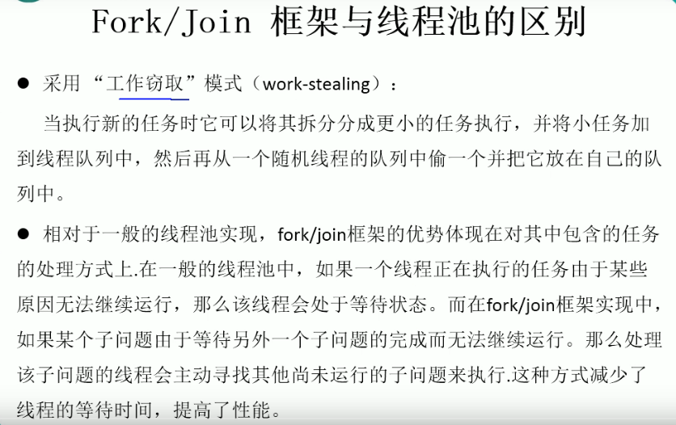

---
2019-08-27 10:04:49

---

#

ForkJoinPool分支合并框架

在JDK1.7以后才出来的；




```java
public class TestForkJoinPool {

    public static void main(String[] args) {
        Instant start = Instant.now();
        ForkJoinPool pool = new ForkJoinPool();
        ForkJoinTask<Long> task = new ForkJoinSumCalculate(0L,50000000000L);
        Long sum = pool.invoke(task);
        System.out.println("sum = " + sum);
        Instant end = Instant.now();
        System.out.println("耗时为："+ Duration.between(start,end).toMillis());
    }

    @Test
    public void test(){
        Instant start = Instant.now();
        long sum = 0L;
        for (long i = 0L; i <= 50000000000L; i++) {
            sum += i;
        }
        System.out.println("sum = " + sum);
        Instant end = Instant.now();
        System.out.println("耗时为："+ Duration.between(start,end).toMillis());
    }

    /**
     * java8
     */
    @Test
    public void test2(){
        Instant start = Instant.now();
        Long sum = LongStream.rangeClosed(0L,50000000000L)
                .parallel()
                .reduce(0L,Long::sum);
        System.out.println("sum = " + sum);
        Instant end = Instant.now();
        System.out.println("耗时为："+ Duration.between(start,end).toMillis());
    }

}

class ForkJoinSumCalculate extends RecursiveTask<Long> {

    private long start;
    private long end;

    private static final long THURSHOLD = 10000L;//临界值

    public ForkJoinSumCalculate(long start, long end) {
        this.start = start;
        this.end = end;
    }

    protected Long compute() {
        long length = end - start;
        if(length<=THURSHOLD){
            long sum = 0L;
            for (long i = start; i <= end; i++) {
                sum += i;
            }
            return sum;
        }else{
            long middle = (start+end)/2;
            ForkJoinSumCalculate left = new ForkJoinSumCalculate(start,middle);
            // 进行拆分，同时压入线程队列
            left.fork();
            ForkJoinSumCalculate right = new ForkJoinSumCalculate(middle+1,end);
            // 拆分
            right.fork();
            // 合并
            return left.join()+right.join();
        }
    }
}
```

