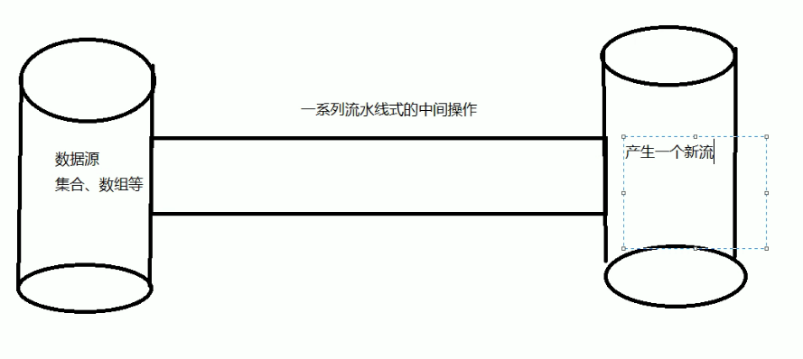
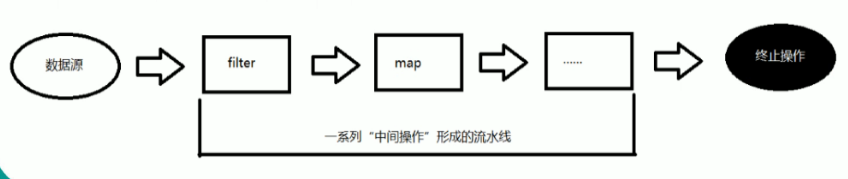

---
2019-09-03 09:06:23

---

#

##了解Stream

Java8中有两大最为重要的改变。第一个是Lambda表达式；另外一个则是**Stream API**（java.util.stream.*）。

Stream是Java8中处理集合的关键抽象概念，它可以指定你希望对集合进行的操作，可以执行非常复杂的查找、过滤和映射数据等操作。

使用Stream API对集合数据进行操作，就类似于使用**SQL执行的数据库查询**。

也可以使用Stream API来**并行执行操作**。

简而言之，Stream API提供了一种高效且易于使用的处理数据的方式；


##什么是Stream



流（Stream）到底是什么呢？

是数据渠道，用于操作数据源（集合、数组等）所生成的元素序列。

**"集合讲的是数据，流讲的是计算！"**

注意：

1. Stream自己不会存储元素。
2. Stream不会改变源对象，相反，他们会返回一个持有结果的新Stream。
3. Stream操作是延迟执行的，这意味着他们会等到需要结果的时候才执行。


##Stream的操作三个步骤



1. 创建Stream
   - 一个数据源（如：集合、数组），获取一个流；
2. 中间操作
   - 一个中间操作链，对数据源的数据进行处理；
3. 终止操作（终端操作）
   - 一个终止操作，执行中间操作链，并产生结果


##测试

1. 创建流

   - 可以通过Collection系列集合提供的stream()或者parallelStream()获取
   - 通过Arrays中的静态方法stream()获取数组流
   - 通过Stream类中的静态方法of()方法
   - 创建无限流
     - 迭代：iterate()
     - 生成：generate()

   ```java
   public class TestStreamAPI1 {
   
       // 创建Stream
       @Test
       public void test1(){
           // 1. 可以通过Collection系列集合提供的stream()或者parallelStream()获取
           List<String> list = new ArrayList<>();
           Stream<String> stream1 = list.stream();
           // 2. 通过Arrays中的静态方法stream()获取数组流
           Employee[] emps = new Employee[10];
           Stream<Employee> stream2 = Arrays.stream(emps);
           // 3. 通过Stream类中的静态方法of()方法
           Stream<String> stream3 = Stream.of("aa", "bb", "cc");
           // 4. 创建无限流
           // 迭代
           Stream<Integer> stream4 = Stream.iterate(0, (x) -> x + 2);
           stream4.limit(10).forEach(System.out::println);
           // 生成
           Stream<Double> stream5 = Stream.generate(() -> Math.random());
           stream5.limit(10).forEach(System.out::println);
       }
   
   }
   ```

2. 中间操作

3. 终止操作（终端操作）