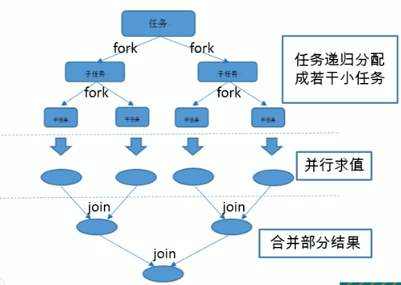

---
2019-09-03 17:51:02

---

#

**并行流**就是把一个内容分成多个数据块，并用不同送的线程分别处理每个数据块的流。

Java8中奖并行进行了优化，我们可以很容易的对数据进行并行操作。

Stream API可以声明性地通过parallel()与sequential()在并行流与串行流之间进行切换。

##了解Fork/Join框架

Fork/Join框架：就是在必要的情况下，将一个大任务，进行拆分(fork)成若干个小任务（拆分到不可再拆时），再将一个个小任务运算的结果进行join汇总；



###Fork/Join框架与传统线程池的区别

采用“工作窃取”模式（work-stealing）

当执行新的任务时它可以将其拆分分成更小的任务执行，并将小任务加载到线程队列中，然后再从一个随机线程的队列中偷一个并把它放入到自己的队列中。

相对于一般的线程池实现，fork/join框架的优势体现在对其中包含的任务的处理方式上：

- 在一般的线程池中，如果一个线程正在执行的任务由于某些原因无法继续运行，那么该线程会处于等待状态。
- 在fork/join框架实现中，如果某个子问题由于等待另外一个子问题的完成而无法继续运行，那么处理该子问题的线程会主动寻求其他尚未运行的子问题来执行，这种方式减少了线程的等待时间，提高了性能；

####测试

计算求和：

1. 定义一个类，继承RecursiveAction或者RecursiveTask，这里需要返回值，继承RecursiveTask；
   - RecursiveAction无返回值
   - RecursiveTask有返回值
2. 定义start、end、THRESHOLD临界值；
3. 重写compute方法，在需要拆分的时候fork两部分，然后join；
4. 测试类，需要用ForkJoinPool来获取


ForkJoinCalculate类：

```java
public class ForkJoinCalculate extends RecursiveTask<Long> {

    private long start;
    private long end;
    // 拆分临界值
    private static final long THRESHOLD = 10000;

    public ForkJoinCalculate(long start, long end) {
        this.start = start;
        this.end = end;
    }

    @Override
    protected Long compute() {
        long length = end - start;
        if(length<=THRESHOLD){
            long sum = 0;
            for (long i = start; i <= end; i++) {
                sum += i;
            }
            return sum;
        } else {
            long middle = (start + end) / 2;
            ForkJoinCalculate left = new ForkJoinCalculate(start, middle);
            // 拆分子任务同时压入线程队列
            left.fork();
            ForkJoinCalculate right = new ForkJoinCalculate(middle+1, end);
            right.fork();
            return left.join() + right.join();
        }
    }
}
```

测试：

先测试一个亿的处理时间，再测试100个亿处理的时间

```java
public class TestForkJoin {

    /**
     * Fork/Join框架
     */
    @Test
    public void test1(){
        Instant start = Instant.now();
        ForkJoinPool pool = new ForkJoinPool();
        ForkJoinTask<Long> task = new ForkJoinCalculate(0L,10000000000L);
        Long sum = pool.invoke(task);
        System.out.println("sum = " + sum);
        Instant end = Instant.now();
        System.out.println("耗费时间为：" + Duration.between(start,end).toMillis());//143  2334
    }

    /**
     * 普通for
     */
    @Test
    public void test2(){
        long sum = 0L;
        Instant start = Instant.now();
        for (long i = 0; i < 10000000000L; i++) {
            sum += i;
        }
        Instant end = Instant.now();
        System.out.println("耗费时间为：" + Duration.between(start,end).toMillis());//67  5672
    }

    /**
     * java8并行流
     */
    @Test
    public void test3(){
        Instant start = Instant.now();
        LongStream.rangeClosed(0,100000000L)
                .parallel()
                .reduce(0,Long::sum);
        Instant end = Instant.now();
        System.out.println("耗费时间为：" + Duration.between(start,end).toMillis());//137  2564
    }

}
```

可以看到由于并行需要在fork方面消耗一点性能，但是随着数据量的上升，并行流比串行流效率也会逐渐提高，可以打开系统任务管理器页面看cpu占用情况。