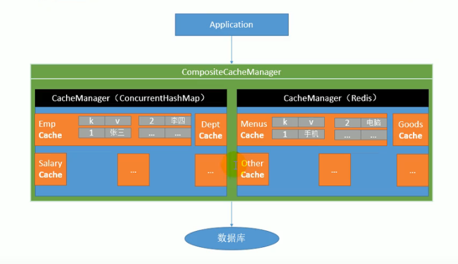

---
2019-07-31 14:54:07

---


快速体验缓存

1. 开启基于注解的缓存@EnableCaching

   ```java
   @SpringBootApplication
   @MapperScan(basePackages = {"top.tomxwd.cache.mapper"})
   @EnableCaching
   public class Springboot01CacheApplication {
   
       public static void main(String[] args) {
           SpringApplication.run(Springboot01CacheApplication.class, args);
       }
   
   }
   ```

2. 标注缓存注解即可

   

   @Cacheable：

   - 将方法的运行结果进行缓存；以后再要相同的数据，直接从缓存中获取，不会再调用方法

   - CacheManager管理多个Cache组件，对缓存的真正CRUD操作在Cache组件中，每一个缓存组件有自己唯一一个名字

     

   - cacheName/value：指定缓存的名字；

   - key：缓存数据使用的key；可以用它来指定，**默认是使用方法参数的值**，比如1-方法的返回值，还可以**使用SpEL表达式**:

     `#{id}`：参数id的值

     `#a0`，`#p0`，`#root.args[0]`

     

   - keyGenerator：key的生成器，可以自己指定key的生成器的组件id； **key跟keyGenerator二选一使用**

   - cacheManager：指定缓存管理器；或者cacheResolver，也是**二选一使用**

   - condition：指定符合条件的情况下，才缓存，例如condtion="#{id}>0"表示id>0的时候才使用缓存

   - unless：除非，否定缓存，当unless指定的条件为true，就不缓存，**还可以获取到结果再进行判断**

     例如：

     unless = “#result==null” 如果返回结果是null就不缓存了

   - sync：是否使用异步模式

3. 打上@cacheable注解进行测试，查看是否生效

   ```java
   @RestController
   public class EmployeeController {
   
       @Autowired
       private EmployeeService employeeService;
   
       @GetMapping("/emp/{id}")
       @Cacheable(cacheNames = "emp")
       public Employee getEmployee(@PathVariable("id") Integer id){
           Employee emp = employeeService.getEmp(id);
           return emp;
       }
   }
   ```

   