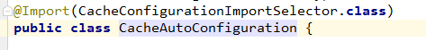
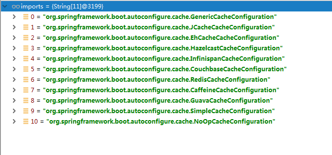

---
2019-07-31 15:46:22

---

原理：

1. 自动配置类：CacheAutoConfiguration

   

2. 查看import了哪些组件进来：

   

   - org.springframework.boot.autoconfigure.cache.GenericCacheConfiguration
   - org.springframework.boot.autoconfigure.cache.JCacheCacheConfiguration
   - org.springframework.boot.autoconfigure.cache.EhCacheCacheConfiguration
   - org.springframework.boot.autoconfigure.cache.HazelcastCacheConfiguration
   - org.springframework.boot.autoconfigure.cache.InfinispanCacheConfiguration
   - org.springframework.boot.autoconfigure.cache.CouchbaseCacheConfiguration
   - org.springframework.boot.autoconfigure.cache.RedisCacheConfiguration
   - org.springframework.boot.autoconfigure.cache.CaffeineCacheConfiguration
   - org.springframework.boot.autoconfigure.cache.GuavaCacheConfiguration
   - org.springframework.boot.autoconfigure.cache.SimpleCacheConfiguration
   - org.springframework.boot.autoconfigure.cache.NoOpCacheConfiguration

3. import了那么多个配置类，那么哪个默认生效？

   - 把配置文件的debug改为true，可以看到spring加载的配置有哪些
   - 可以看到**默认是SimpleCacheConfiguration生效**
   - SimpleCacheConfiguration的作用是把ConcurrentMapCacheManager注入进容器中。这是一个CacheManager；
   - ConcurrentMapCacheManager可以获取和**创建ConcurrentMapCache**类型的缓存组件
   - 而ConcurrentMapCache则是**将数据保存在一个ConcurrentMap**中

4. 运行的流程：

   - @Cacheable

     1. 方法运行之前，先去查询Cache（缓存组件），按照cacheNames指定的名字获取；

        （CacheManage先获取相应的缓存）；
        第一次获取缓存的时候没有Cache组件，会自动创建。

     2. 去Cache中查找缓存的内容，使用一个key，默认是方法的参数；

        key是按照某种策略生成的，默认是使用KeyGeneractor生成的，默认是使用SimpleKeyGeneractor生成key。

        **SimpleKeyGeneractor**生成策略：

        ​	如果没有参数：key=new SimpleKey();

        ​	如果有一个参数：key=参数的值;

        ​	如果有多个参数：key=new SimpleKey(params);

     3. 没有查到缓存就调用目标方法；

     4. 将目标方法返回的结果放入缓存。

   - **@Cacheable标注的方法执行之前先来检查缓存中有没有这个数据，默认按照参数的值作为key查询缓存，如果没有就运行方法并将结果放入缓存。**以后再来调用就可以直接使用缓存中的数据。

5. 核心：

   - 使用CacheManager【SimpleCacheConfiguration】按照名字得到Cache【ConcurrentMapCache】组件
   - key使用**KeyGeneractor**生成的，默认使用**SimpleKeyGeneractor**生成key。

