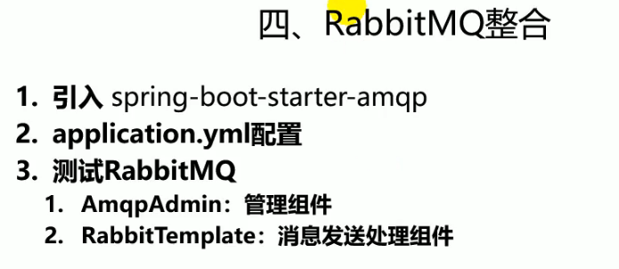
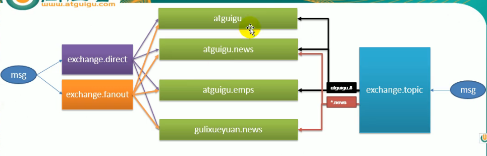
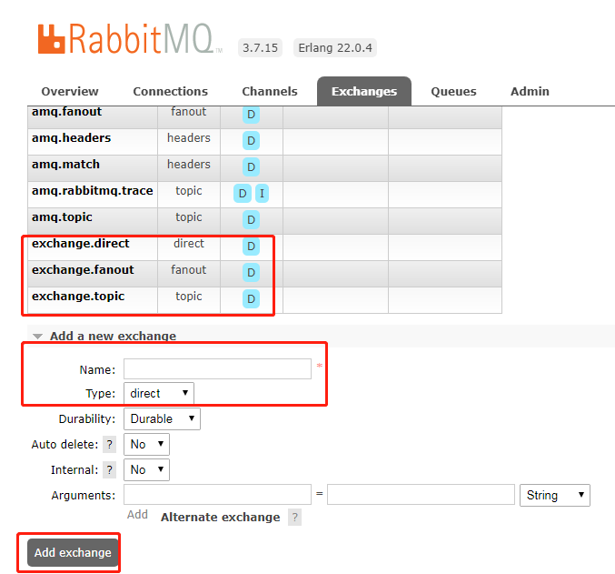
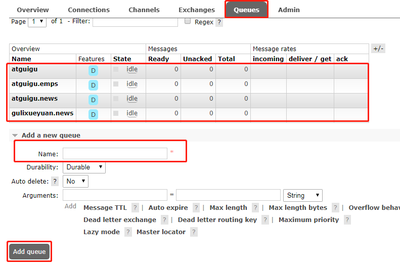
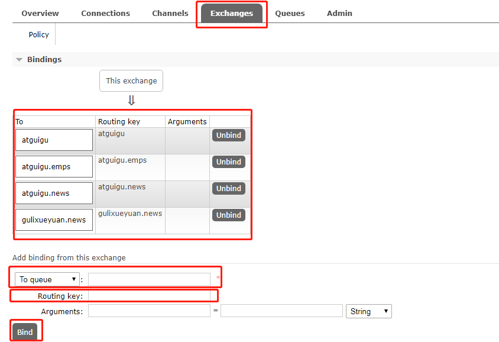
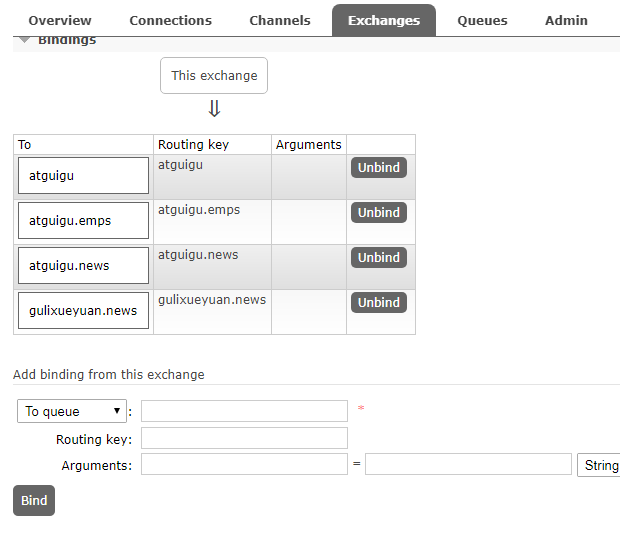
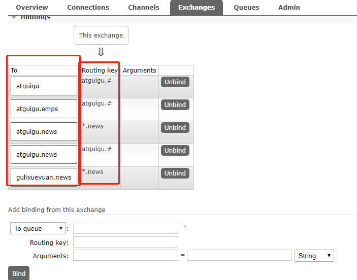
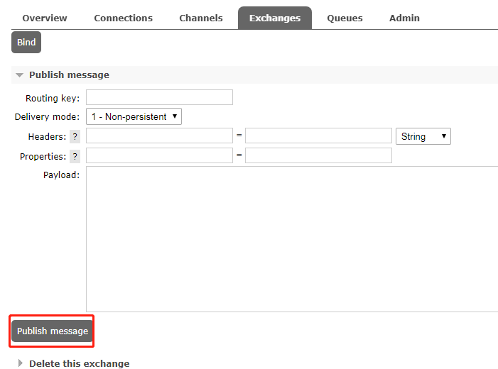

---
2019-08-02 09:13:59

---





在docker上进行安装rabbitMQ，找Tag包含management的，这种版本带web管理界面。

```shell
docker run -d -p 12387:5672 -p 12386:15672 --name myrabbitmq rabbitmq：management
```

访问：`tomxwd.top:12386`进入rabbitmq管理界面；

用户名密码都是guest；



1. 添加三个exchange交换机

   

2. 添加队列

   

3. 绑定exchange和queue

   direct，fanout，topic都要按上面图的规则进行绑定。

   exchange.direct：

   

   exchange.fanout:

   

   exchange.topic:

   

4. 发布信息，对三种模式都进行测试

   

5. 