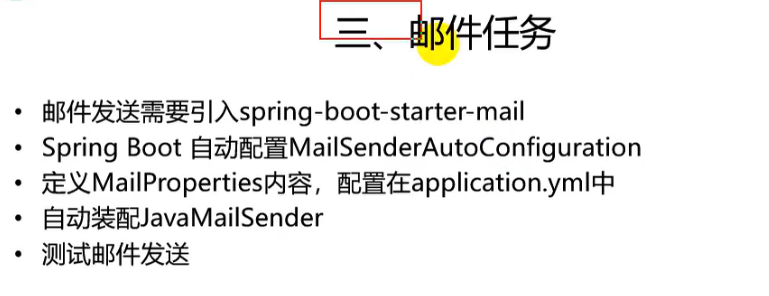
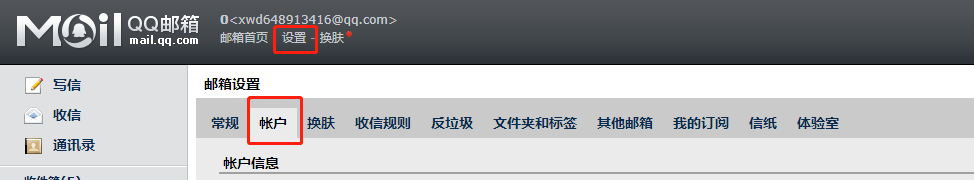
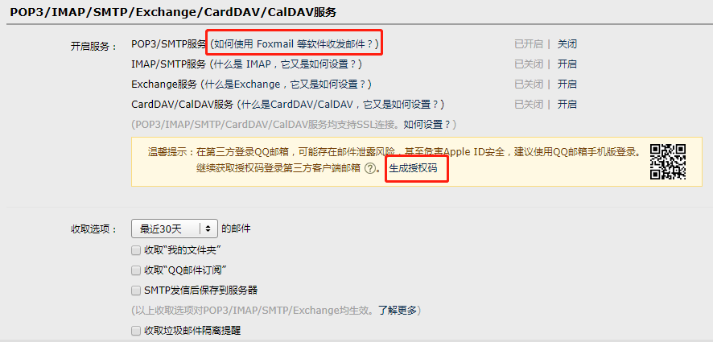
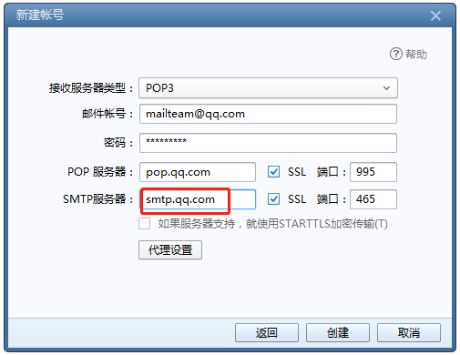

---
2019-08-14 09:57:32
---











依赖信息：

```xml
<!-- 邮件依赖 -->
<dependency>
    <groupId>org.springframework.boot</groupId>
    <artifactId>spring-boot-starter-mail</artifactId>
</dependency>
```


配置：

```properties
spring.mail.username=Xxxxx@qq.com
spring.mail.password=xxxxxkurkdmabdhd
spring.mail.host=smtp.qq.com
spring.mail.properties.mail.smtp.ssl.enable=true
```


测试：

```java
@RunWith(SpringRunner.class)
@SpringBootTest
public class Springboot04TaskApplicationTests {

    @Autowired
    private JavaMailSender mailSender;
    @Test
    public void testMail() {
        // 简单邮件
        SimpleMailMessage message = new SimpleMailMessage();
        // 邮件设置
        // 标题
        message.setSubject("哈喽-今晚买啥，看我的");
        // 内容
        message.setText("房大四，苏崽阳请注意，我又来攻击你们了。");
        // 发送到哪个邮箱
        message.setTo("Xxx@qq.com","Xxx@qq.com");
        // 邮件来自谁
        message.setFrom("Xxx@qq.com");
        mailSender.send(message);
    }

    @Test
    public void test2() throws MessagingException {
        // 复杂邮件
        // 1. 创建一个复杂的消息邮件
        MimeMessage mimeMessage = mailSender.createMimeMessage();
        MimeMessageHelper mimeMessageHelper = new MimeMessageHelper(mimeMessage, true);
        // 邮件设置
        // 标题
        mimeMessageHelper.setSubject("哈喽-今晚买啥，看我的");
        // 内容 需要html设置为true
        mimeMessageHelper.setText("<h1>通知,通知</h1><br><b style='color:red'>房大四，苏崽阳请注意，我又来攻击你们了。</b>",true);
        // 发送到哪个邮箱
        String[] address = {"Xxxx@qq.com"};
        mimeMessageHelper.setTo(address);
        // 邮件来自谁
        mimeMessageHelper.setFrom("Xxxx@qq.com");
        // 上传文件
        mimeMessageHelper.addAttachment("1.jpg",new File("Xxxxfavicon.ico"));
        mailSender.send(mimeMessage);
    }

}
```


