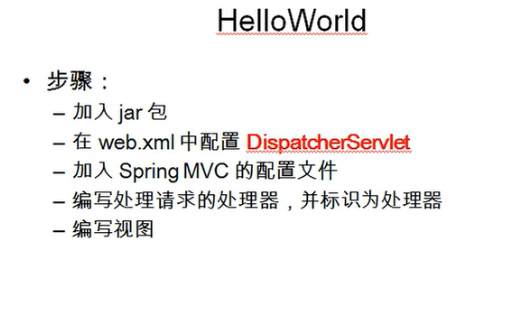

---
2019-07-24 14:43:48
---


1. 

pom.xml:

```xml
<dependencies>
    <dependency>
        <groupId>org.springframework</groupId>
        <artifactId>spring-webmvc</artifactId>
        <version>4.3.20.RELEASE</version>
    </dependency>
    <dependency>
        <groupId>commons-logging</groupId>
        <artifactId>commons-logging</artifactId>
        <version>1.2</version>
    </dependency>
</dependencies>
```


web.xml:

```xml
<?xml version="1.0" encoding="UTF-8"?>
<web-app xmlns="http://java.sun.com/xml/ns/javaee"
           xmlns:xsi="http://www.w3.org/2001/XMLSchema-instance"
           xsi:schemaLocation="http://java.sun.com/xml/ns/javaee
		  http://java.sun.com/xml/ns/javaee/web-app_2_5.xsd"
           version="2.5">

    <!--配置DispatcherServlet-->
    <servlet>
        <servlet-name>dispatcherServlet</servlet-name>
        <servlet-class>org.springframework.web.servlet.DispatcherServlet</servlet-class>
        <!--配置DispatcherServlet的一个初始化参数：配置SpringMvc配置文件的位置和名称-->
        <!--实际上也可以不通过contextConfigLocation来配置springmvc的配置文件，而使用默认的
        默认的配置文件为：/WEB-INF/<servlet-name>-servlet.xml
        即为：dispatcherServlet-servlet.xml -->
        <init-param>
            <param-name>contextConfigLocation</param-name>
            <param-value>classpath:springmvc.xml</param-value>
        </init-param>
        <load-on-startup>1</load-on-startup>
    </servlet>

    <servlet-mapping>
        <servlet-name>dispatcherServlet</servlet-name>
        <url-pattern>/</url-pattern>
    </servlet-mapping>

</web-app>
```

springmvc.xml:

```xml
<?xml version="1.0" encoding="UTF-8"?>
<beans xmlns="http://www.springframework.org/schema/beans"
       xmlns:xsi="http://www.w3.org/2001/XMLSchema-instance"
       xmlns:context="http://www.springframework.org/schema/context"
       xsi:schemaLocation="http://www.springframework.org/schema/beans http://www.springframework.org/schema/beans/spring-beans.xsd http://www.springframework.org/schema/context https://www.springframework.org/schema/context/spring-context.xsd">

    <!--配置注解扫描的包-->
    <context:component-scan base-package="top.tomxwd"/>

    <!--配置视图解析器：如何把controller方法返回值解析为实际的物理视图-->
    <bean class="org.springframework.web.servlet.view.InternalResourceViewResolver">
        <property name="prefix" value="/WEB-INF/views/"></property>
        <property name="suffix" value=".jsp"></property>
    </bean>


</beans>
```

HelloController:

```java
package top.tomxwd.controller;

import org.springframework.stereotype.Controller;
import org.springframework.web.bind.annotation.RequestMapping;

@Controller
public class HelloController {

    /**
     * 1.使用@RequestMapping 注解来映射请求的url
     * 2.返回值会通过视图解析器解析为实际的物理视图，
     * 对于InternalResourceViewResolver视图解析器会做如下的解析：
     * 通过 prefix + returnVal + suffix 通过这样的方式得到实际的物理视图，
     * 然后做转发操作
     *
     * /WEB-INF/views/success.jsp
     *
     * @return
     */
    @RequestMapping("/hello")
    public String hello(){
        System.out.println("hello world");
        return "success";
    }


}
```

/WEB-INF/views/success.jsp:

```jsp
<%@ page contentType="text/html;charset=UTF-8" language="java" %>
<html>
<head>
    <title>success</title>
</head>
<body>
    <h4>success</h4>
</body>
</html>

```

index.jsp:

```jsp
<%@ page contentType="text/html;charset=UTF-8" language="java" %>
<html>
<head>
    <title>index</title>
</head>
<body>

    <a href="hello">hello world</a>

</body>
</html>
```

