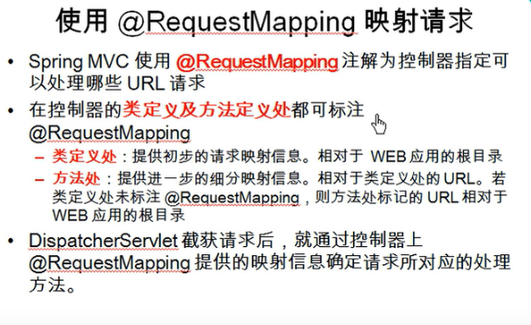
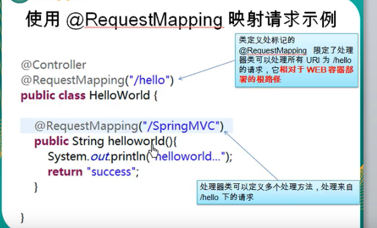

---
2019-07-24 16:18:40
---







SpringMvcTest:

```java
@RequestMapping("/springmvc")
@Controller
public class SpringMvcTest {

    private final String SUCCESS = "success";

    /**
     * 1. @RequestMapping 除了修饰方法还可以修饰类
     * 2. 类定义处：提供初步的请求映射信息，相对于WEB应用的根目录
     *    方法处：提供进一步的细分映射信息，相对于类定义处的URL，若类定义处未标注@RequestMapping
     *    则方法处标记的URL相对于WEB应用的根目录
     * @return
     */
    @RequestMapping("/testRequestMapping")
    public String testRequestMapping(){
        System.out.println("SpringMvcTest.testRequestMapping");
        return SUCCESS;
    }

}
```

