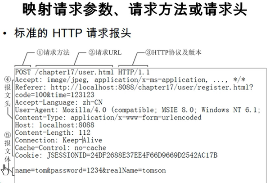
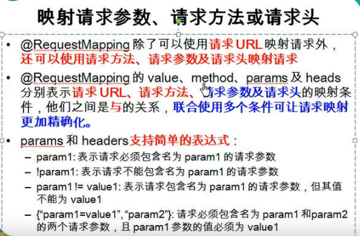

---
2019-07-24 16:30:00
---







RequestMethodController:

```java
@Controller
public class RequestMethodController {

    public static final String SUCCESS = "success";

    /**
     * 常用：使用method属性来指定请求方式
     * @return
     */
    @RequestMapping(value = "/method",method = RequestMethod.POST)
    public String testMethod(){
        System.out.println("RequestMethodController.testMethod");
        return SUCCESS;
    }


}
```


index.jsp:

```jsp
<form action="method" method="post">
    <input type="submit" value="submit">
</form>
```

