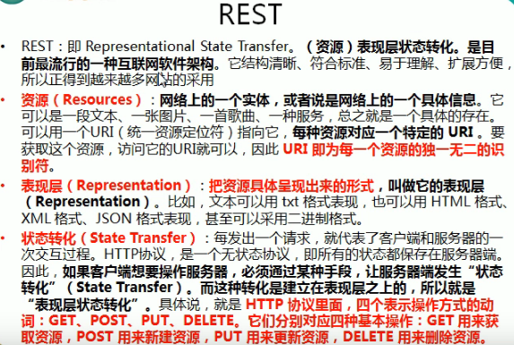
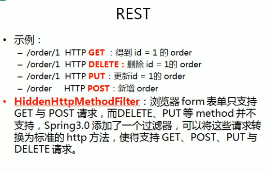

---
2019-07-24 17:10:40
---





1. 理解本真的REST架构风格：[网址](http://kb.cnblogs.com/page/186516)

2. 深入浅出REST：[网址](http://www.infoq.com/cn/articles/rest-introduction)





web.xml增加配置HiddenHttpMethodFilter:

```xml
<!--配置HiddenHttpMethodFilter：可以把post请求转为delete或put请求-->
<filter>
    <filter-name>hiddenHttpMethodFilter</filter-name>
    <filter-class>org.springframework.web.filter.HiddenHttpMethodFilter</filter-class>
</filter>
<filter-mapping>
    <filter-name>hiddenHttpMethodFilter</filter-name>
    <url-pattern>/*</url-pattern>
</filter-mapping>
```


jsp页面添加如下内容（index.jsp即可）：

```jsp
<hr>
    <h4>REST测试</h4>
    <a href="rest/1">GET</a>
    <form method="post" action="rest">
        <input type="submit" value="POST">
    </form>
    <form method="post" action="rest/1">
        <input type="hidden" name="_method" value="DELETE">
        <input type="submit" value="DELETE">
    </form>
    <form method="post" action="rest/1">
        <input type="hidden" name="_method" value="PUT">
        <input type="submit" value="PUT">
    </form>
<hr>
```


controller内容：

```java
/**
     * REST风格的URL
     * 以CRUD为例：
     * 新增：/order POST
     * 修改：/order/1 PUT
     * 获取：/order/1 GET
     * 删除: /order/1 DELETE
     *
     * 如何发送PUT请求和DELETE请求：
     * 1. 配置HiddenHttpMethodFilter
     * 2. 发送POST请求
     * 3. 发送POST请求时携带一个隐藏域name="_method"的隐藏域，值为DELETE或PUT
     *
     * 在SpringMvc中的目标方法中如何得到id？
     * 使用@PathVariable注解
     *
     * @param id
	 * @return
*/
@RequestMapping(value = "/rest/{id}",method = RequestMethod.PUT)
public String testRestPut(@PathVariable("id") Integer id){
    System.out.println("RequestMethodController.testRestPut "+id);
    return SUCCESS;
}

@RequestMapping(value = "/rest/{id}",method = RequestMethod.DELETE)
public String testRestDelete(@PathVariable("id") Integer id){
    System.out.println("RequestMethodController.testRestDelete "+id);
    return SUCCESS;
}

@RequestMapping(value = "/rest",method = RequestMethod.POST)
public String testRestPost(){
    System.out.println("RequestMethodController.testRestGet");
    return SUCCESS;
}

@RequestMapping(value = "/rest/{id}",method = RequestMethod.GET)
public String testRestGet(@PathVariable("id") Integer id){
    System.out.println("RequestMethodController.testRestGet "+id);
    return SUCCESS;
}
```

