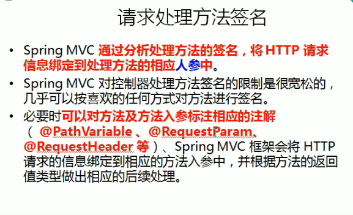
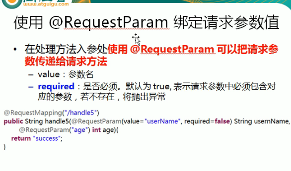

---
2019-07-25 09:29:12

---


1. 


2. 

3. ```java
   /**
        * @RestParam来映射请求参数
        * value与name等价 值即为请求参数的参数名
        * required 该参数是否必须，默认为true
        * defaultValue 请求值的默认参数
        *
        * @param username
        * @param age
        * @return
   */
   @RequestMapping(value = "/testParam")
   public String testParam(@RequestParam(value = "username") String username,@RequestParam(value = "age",required = false,defaultValue = "0") int age){
       System.out.println("RequestMethodController.testParam username: "+username+" age: "+age);
       return SUCCESS;
   }
   ```

   