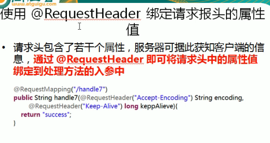

---
2019-07-25 09:40:48

---


1. 

2. ```java
   /**
        * 了解：
        * 作用：映射请求头信息
        * 用法同@RequestParam
        * @param al
        * @return
   */
   @RequestMapping("/requestHeader")
   public String testRequestHeader(@RequestHeader(value = "Accept-Language")String al){
       System.out.println("RequestMethodController.testRequestHeader Accept-Language :"+al);
       return SUCCESS;
   }
   ```

3. 

