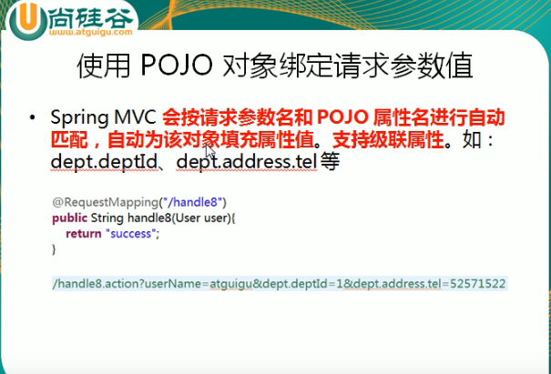

---
2019-07-25 10:02:55

---


1. 

2. ```java
   @RequestMapping(value = "testPojo",method = RequestMethod.POST)
   public String testPojo(User user){
       System.out.println("RequestMethodController.testPojo User:"+user);
       return SUCCESS;
   }
   ```

3. 

