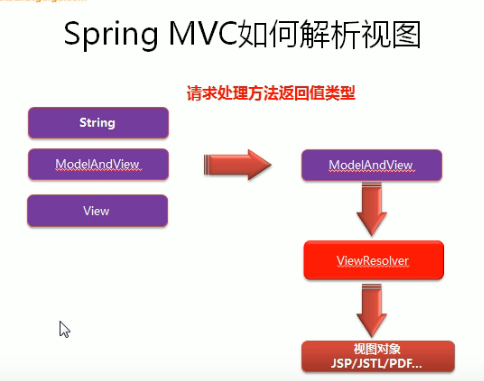
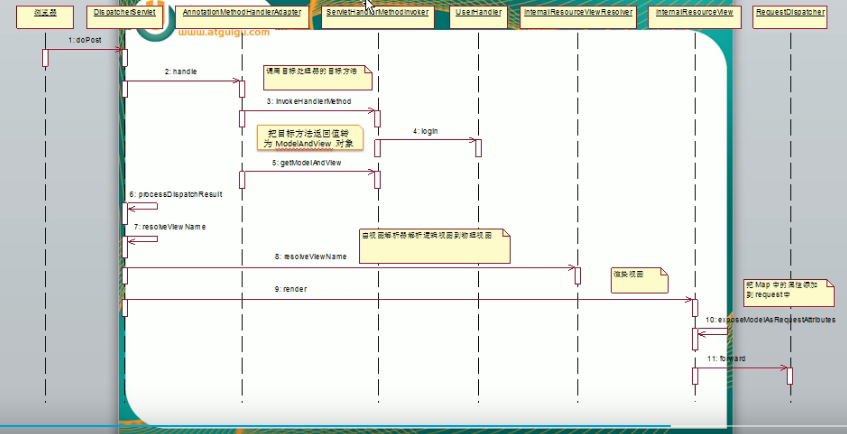
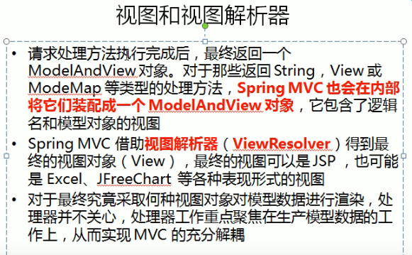
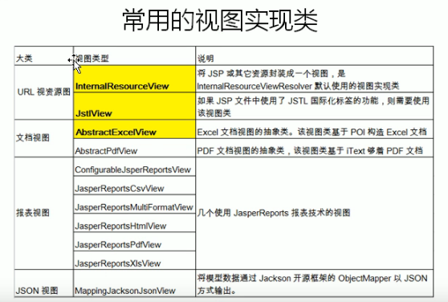
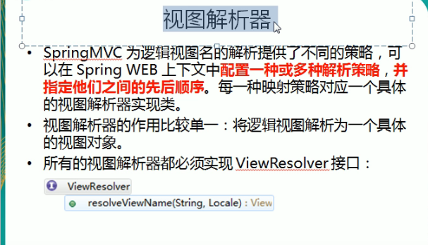
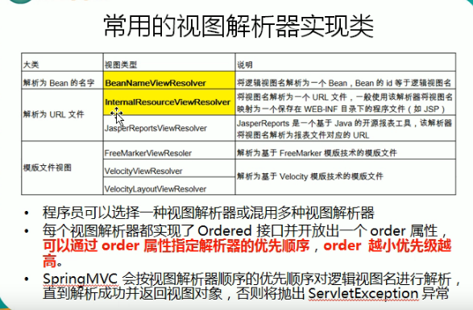
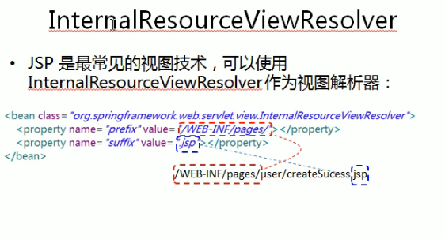

---
2019-07-25 15:08:47

---

1. 
2. 
3. 
4. 
5. 
6. 
7. 
8. 
9. 调用一个方法返回String类型，View类型或其他类型，SpringMvc都会转为ModelAndView类型，通过视图解析器得到真正的物理视图View对象，最终调用View的render方法得到响应结果，常用的视图InternalResourceView，常用的视图解析器InternalResourceViewResolver，转发之后的结果。

