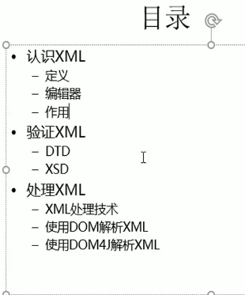
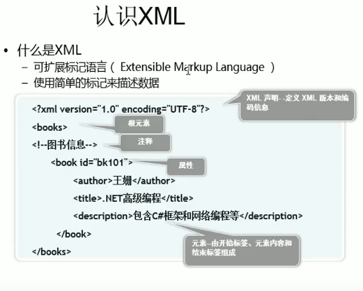
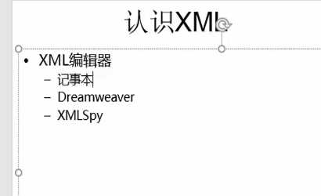
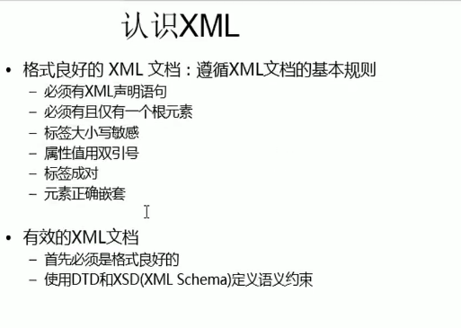
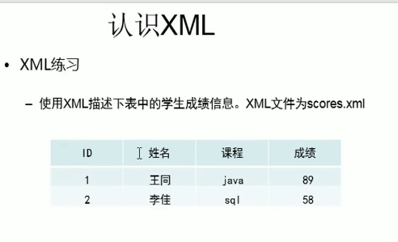

---
2019-08-30 17:08:28

---

#





##

xml简介

xml，eXtensible Markup Language，可扩展标记语言，是一种标记语言。


xml是一种非常灵活的语言，没有固定的标签，所有的标签都可以自定义；


通常，xml被用于信息的记录和传递，因此xml经常被用于充当配置文件；


##

格式良好的xml格式





声明信息，用于描述xml的版本和编码方式：

```xml
<?xml version="1.0" encoding="utf-8" ?>
```


xml有且仅有一个根元素；


xml是大小写敏感的；


标签是成对的，而且要正确嵌套；


属性值要使用双引号；


注释的写法：

```xml
<!--注释-->
```





