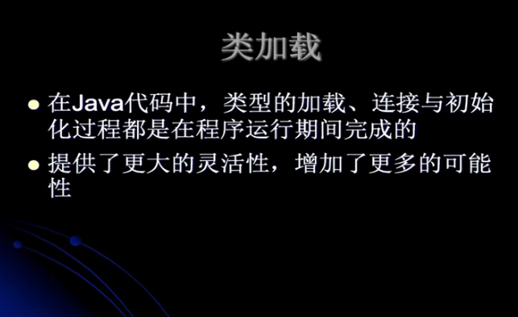
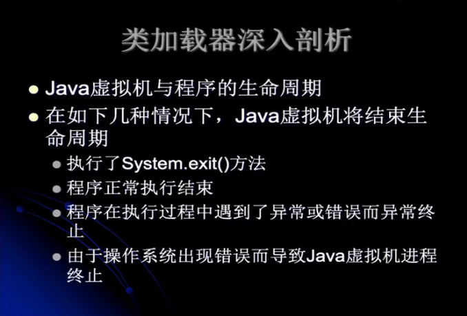
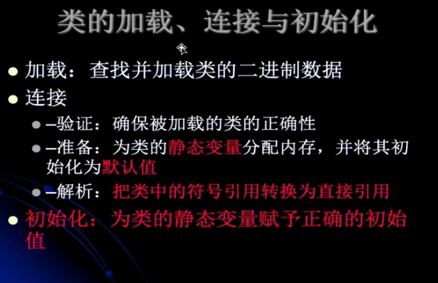

---
2019-08-15 10:24:16

---



## 类加载

- java本身是一门静态类型的语言，但是他的很多特性又具有动态语言才能拥有的特质，也是由于**类型的加载、连接与初始化过程都是在程序运行期间完成的，**这一点起了帮助作用。
- 提供了更强大的灵活性，增加了更多的可能性。


类型的加载：

最常见的是**将已经编译完成的类的文件，加载到内存里；**

连接：

将类与类之间的关系确立好，类与类之间的符号引用转换为直接引用，并且对字节码的一些相关处理（验证、校验）。【虽然我们都是通过编译得到的，但是不排除被修改了字节码】

初始化：

对类型的一些静态变量进行赋值等。






## 类的加载、连接与初始化

1. 加载：查找并加载类的二进制数据；

2. 连接：

   - 验证：**确保被加载的类的正确性**；

   - 准备：为类的静态变量分配内存，并将其初始化为默认值，这里的默认值是指0，null，false等，而不是初始化具体的内容。

     ```java
     public class Test{
         public static int a = 1;
     }
     ```

     比如上面的代码，初始化为默认值，只是将a以0赋值；

   - 解析：**把类中的符号引用转换为直接引用**；

     - 间接的引用方式（一个类里面的方法引用了另一个类）
     - 直接引用就是把方法通过指针的方式，指向了目标对象在内存的位置。

3. 初始化：**把类的静态变量赋予正确的初始值；**如上述代码块中的a=1，真真正正赋值1进去。


## 类的使用与卸载

- 使用
  - 就是开发的时候用的最多的，也就是操作类，用类的方法属性等。
- 卸载
  - 从内存中销毁掉。


