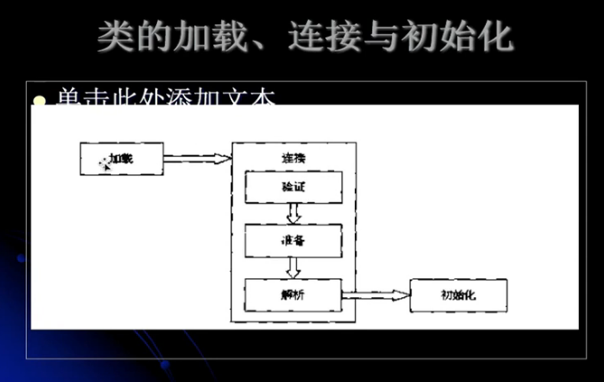
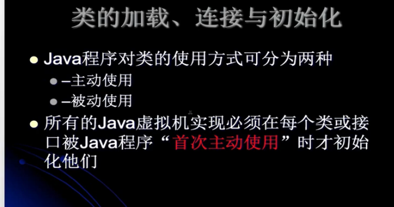
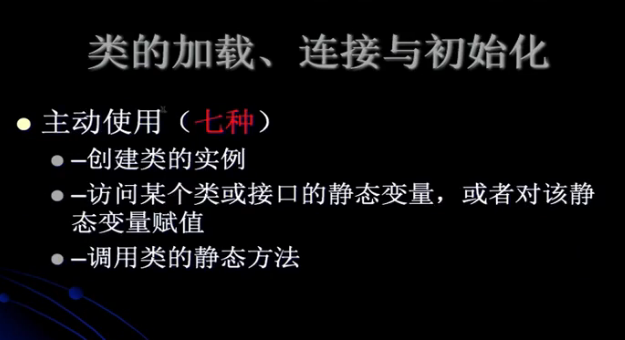
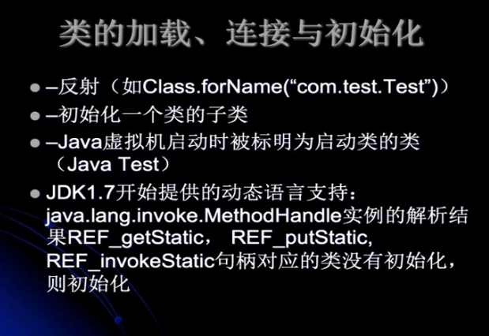
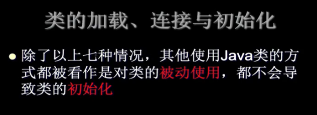
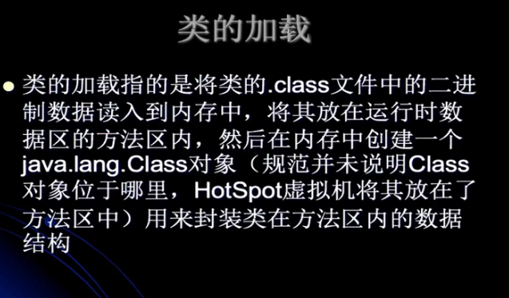
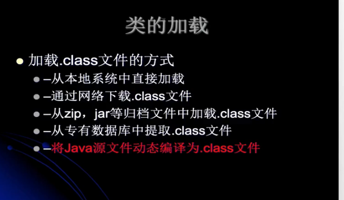

---
2019-08-15 14:15:06

---






## 类的加载、连接和初始化

- Java程序对类的使用方式可以分为两种

  - 主动使用（七种）

    

    

    1. 创建类的实例（new一个对象）

    2. 访问某个类或接口的静态变量，或者对该静态变量赋值（对静态变量取值或赋值）

    3. 调用类的静态方法

       2和3使用的助记符：

       - 访问类变量getstatic
       - 赋值类变量putstatic
       - 调用类方法invokestatic 

    4. 反射：如Class.forName("top.tomxwd.Test")

    5. 初始化一个类的子类，这个类也会被主动使用。

       ```java
       class Parent{
           
       }
       class Child extends Parent{
           
       }
       ```

       当初始化Child的时候，Parent也会被初始化。

    6. Java虚拟机启动时被标明为启动类的类（包含main方法的类）

    7. JDK1.7开始提供的动态语言支持：

       - java.lang.invoke.MethodHandle实例的解析结果REF_getStatic，REF_putStatic，REF_invokeStatic句柄对应的类没有初始化，则初始化。

  - 被动使用

    

    - 除了以上七种情况，其他使用Java类的方式都被看做是对类的**被动使用**，都不会导致类的**初始化**。

- 所有的Java虚拟机实现必须在每个类或接口被Java程序“**首次主动使用**”时才初始化他们。

## 类的加载





## 类的加载

加载.class文件的方式：

- 从本地系统中直接加载
- 通过网络下载.class文件
- 从zip，jar等归档文件中加载.class文件
- 从专有的数据库中提取.class文件
- **将Java源文件动态编译为.class文件**
  - 动态代理
  - JSP===>Servlet


## 测试

### 调用父类的静态变量

代码：

```java
public class MyTest1 {

    public static void main(String[] args) {
        System.out.println(MyChild1.str);
    }


}

class MyParent1{

    public static String str = "hello_world";
    static{
        System.out.println("MyParent1 static static block");
    }
}

class MyChild1 extends MyParent1{

    static {
        System.out.println("MyChild1 static block");
    }

}
```

输出结果：

```
MyParent1 static static block
hello_world
```

可以看到子类并没有执行静态代码块。

### 取子类的静态变量

代码：

```java
public class MyTest1 {

    public static void main(String[] args) {
        System.out.println(MyChild1.str2);
    }


}

class MyParent1{

    public static String str = "hello_world";
    static{
        System.out.println("MyParent1 static static block");
    }
}

class MyChild1 extends MyParent1{

    public static String str2 = "welcome";

    static {
        System.out.println("MyChild1 static block");
    }

}
```

结果：

```
MyParent1 static static block
MyChild1 static block
welcome
```

### 原因

对于静态字段来说，只有直接定义了该字段的类才会被初始化（**在上述就是，因为是父类定义的，所以调用父类的静态字段，只初始化父类**），如果是父类的，那么只会对父类进行直接使用。

对于第二个例子来说，就是**初始化一个类的子类，父类也会被初始化**的情况。第二个例子是对MyChild1的主动使用，所以父类MyPerson1也会被初始化。

当一个类在初始化的时候，要求其父类全部都已经初始化完毕。