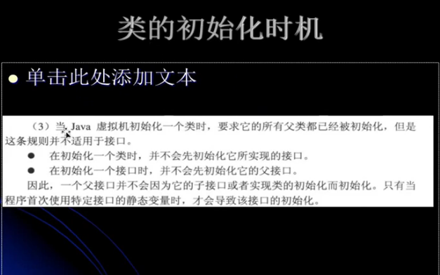

---
2019-08-16 10:10:48

---


## 接口初始化规则

> 以下并不能说明该规则，后面的10_类的初始化对于类和借口的异同点深入解析会有新的例子进行说明。



在初始化一个类的时候，并不会先初始化他所实现的接口。

在初始化一个接口时，并不会初始化它的父接口。

代码：

```java
public class MyTest5 {

    public static void main(String[] args) {
        System.out.println(MyChild5.b);
    }

}

interface MyParent5 {
    public final static int a = 1;
}

interface MyChild5 extends MyParent5{
    public final static int b = new Random().nextInt(10);
}
```

**删除MyParent5.class再运行**

结果：

```
Exception in thread "main" java.lang.NoClassDefFoundError: top/tomxwd/classloader/MyParent5
	at java.lang.ClassLoader.defineClass1(Native Method)
	at java.lang.ClassLoader.defineClass(ClassLoader.java:760)
	at java.security.SecureClassLoader.defineClass(SecureClassLoader.java:142)
	at java.net.URLClassLoader.defineClass(URLClassLoader.java:455)
	at java.net.URLClassLoader.access$100(URLClassLoader.java:73)
	at java.net.URLClassLoader$1.run(URLClassLoader.java:367)
	at java.net.URLClassLoader$1.run(URLClassLoader.java:361)
	at java.security.AccessController.doPrivileged(Native Method)
	at java.net.URLClassLoader.findClass(URLClassLoader.java:360)
	at java.lang.ClassLoader.loadClass(ClassLoader.java:424)
	at sun.misc.Launcher$AppClassLoader.loadClass(Launcher.java:308)
	at java.lang.ClassLoader.loadClass(ClassLoader.java:357)
	at top.tomxwd.classloader.MyTest5.main(MyTest5.java:8)
Caused by: java.lang.ClassNotFoundException: top.tomxwd.classloader.MyParent5
	at java.net.URLClassLoader$1.run(URLClassLoader.java:372)
	at java.net.URLClassLoader$1.run(URLClassLoader.java:361)
	at java.security.AccessController.doPrivileged(Native Method)
	at java.net.URLClassLoader.findClass(URLClassLoader.java:360)
	at java.lang.ClassLoader.loadClass(ClassLoader.java:424)
	at sun.misc.Launcher$AppClassLoader.loadClass(Launcher.java:308)
	at java.lang.ClassLoader.loadClass(ClassLoader.java:357)
	... 13 more
```

其实理解了类的继承，那么interface只是另一种形式，因为他的成员变量全部都是用pubilc static final来修饰的，规则是一样的，常量能确定就确定，不能确定就要初始化。

## 类加载器准备阶段和初始化阶段的重要意义分析

**调用一个类的静态方法时，表示要对这个类进行主动使用，那么会初始化这个类。**

而准备阶段是为了给成员变量赋**默认值**，而初始化阶段，就从上到下执行代码；

代码：

```java
public class MyTest6 {

    public static void main(String[] args) {
        Singleton singleton = Singleton.getInstance();
        System.out.println("Singleton.counter1 = " + Singleton.counter1);
        System.out.println("Singleton.counter2 = " + Singleton.counter2);

    }

}

class Singleton {

    public static int counter1;
    private static Singleton singleton = new Singleton();

    private Singleton(){
        counter1 += 1;
        counter2 += 1;// 准备阶段的意义，如果这时候，counter2没有进行准备阶段赋初值，那么这里是不能运行的。
        System.out.println("counter1 = " + counter1);
        System.out.println("counter2 = " + counter2);
    }

    public static int counter2 = 0;

    public static Singleton getInstance(){
        return singleton;
    }

}
```

输出：

```
counter1 = 1
counter2 = 1
Singleton.counter1 = 1
Singleton.counter2 = 0
```

由此，我们可以明白准备阶段以及初始化阶段的意义，以及整个流程是怎么样的。

