---
2019-08-16 14:00:02

---

# 

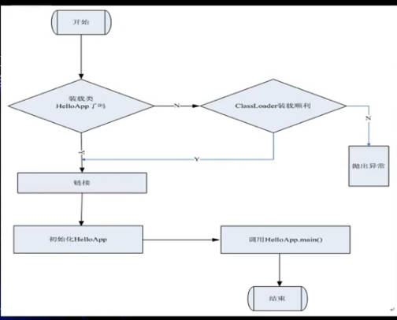

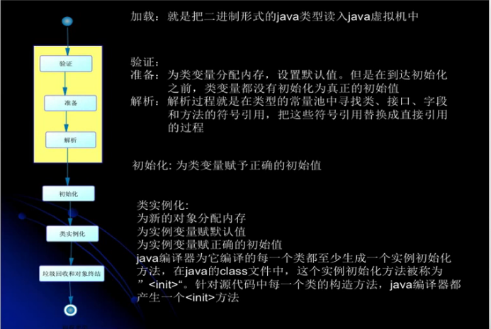

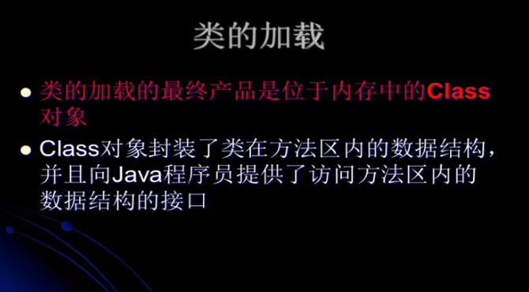

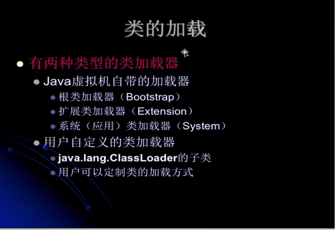

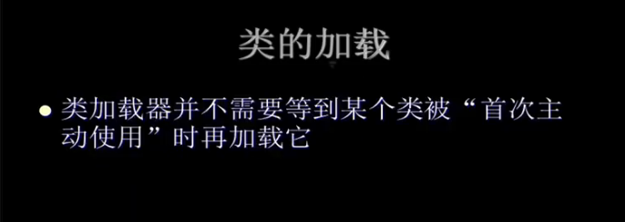

加上`-XX:+TraceClassLoading`查看。

代码：

```java
public class MyTest1 {

    public static void main(String[] args) {
        System.out.println(MyChild1.str);
    }

}

class MyParent1{

    public static String str = "hello_world";
    static{
        System.out.println("MyParent1 static static block");
    }
}

class MyChild1 extends MyParent1{

    public static String str2 = "welcome";

    static {
        System.out.println("MyChild1 static block");
    }

}
```

输出：

```
[Loaded top.tomxwd.classloader.MyParent1 from file:/E:/IDEA-workspace/jvm-test-01/target/classes/]
[Loaded top.tomxwd.classloader.MyChild1 from file:/E:/IDEA-workspace/jvm-test-01/target/classes/]
MyParent1 static static block
hello_world
```

分析：

我们知道，当访问某个类的静态变量，或修改某个类的静态变量，会导致这个类被主动使用，那么就会加载、连接、初始化。而上述的代码，可以看到，被主动使用的是MyParent1类，静态代码块也被执行了，然而我们未主动使用的MyChild1也被类加载器加载了进来。因此：**类加载器并不需要等到某个类被“首次主动使用”时再加载它**；

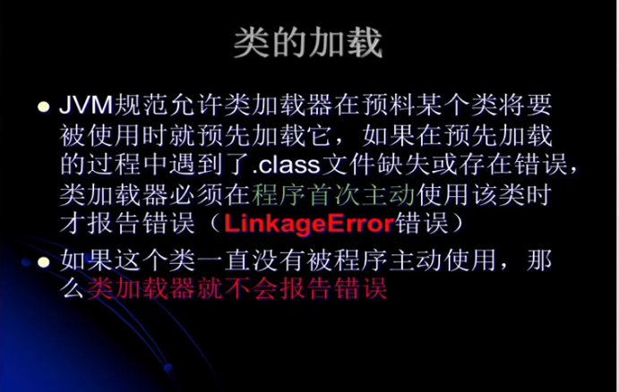

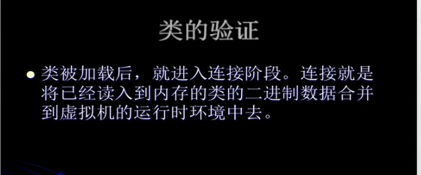

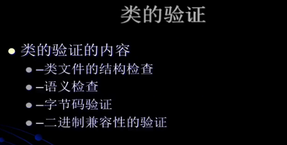

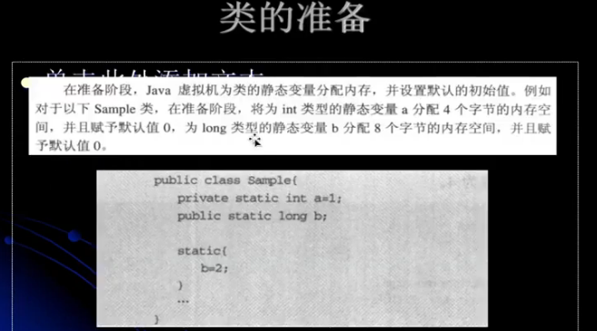

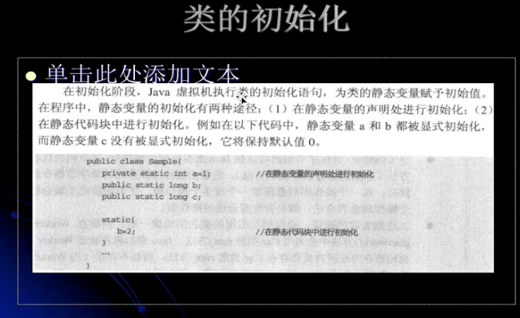

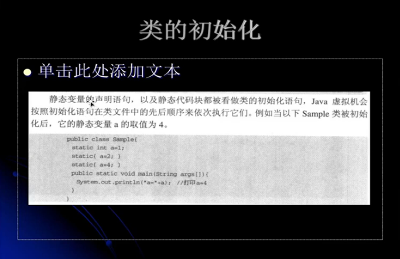

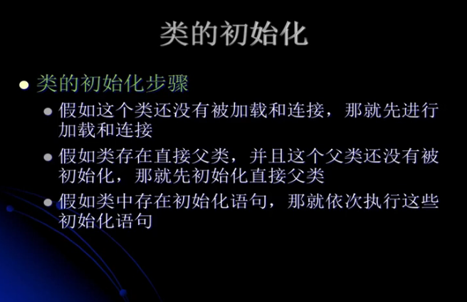

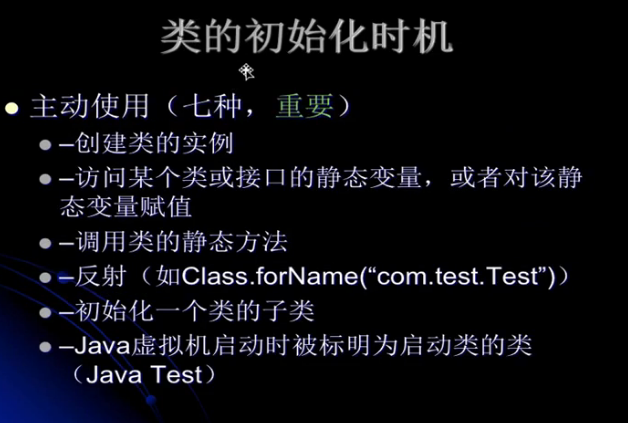

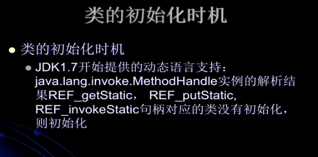

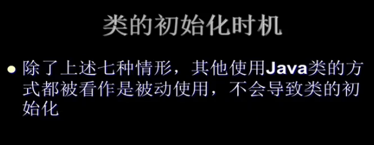

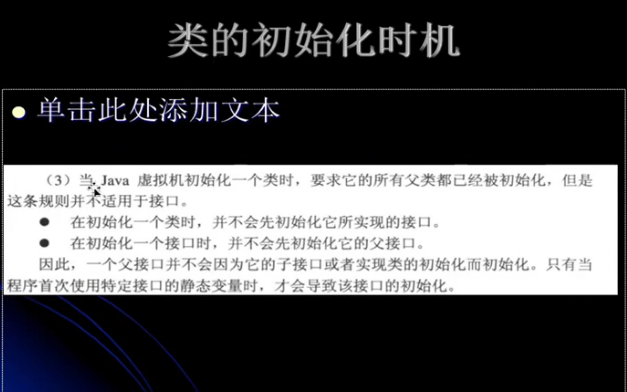

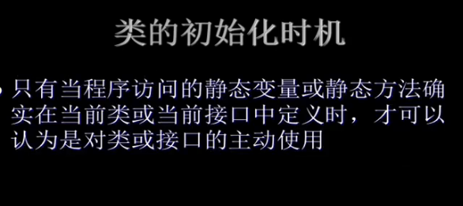

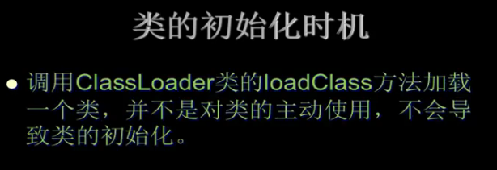

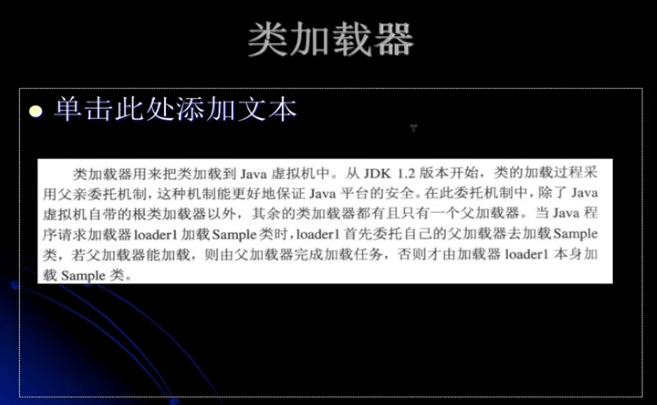

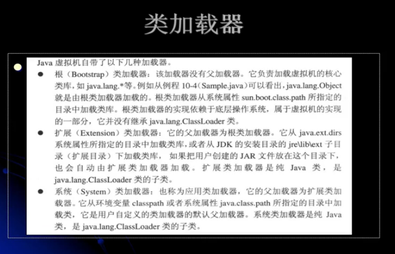

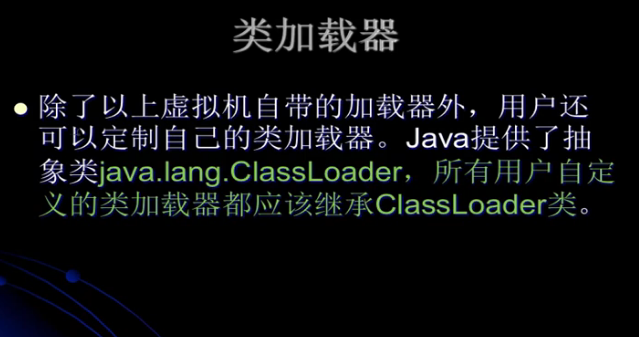

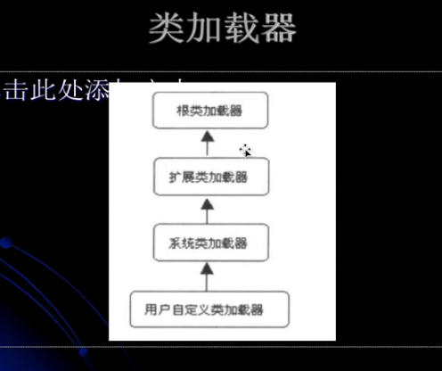

从表象来看他们是一种继承关系，从实际来看他们其实是一种包含关系，从下往上包含。