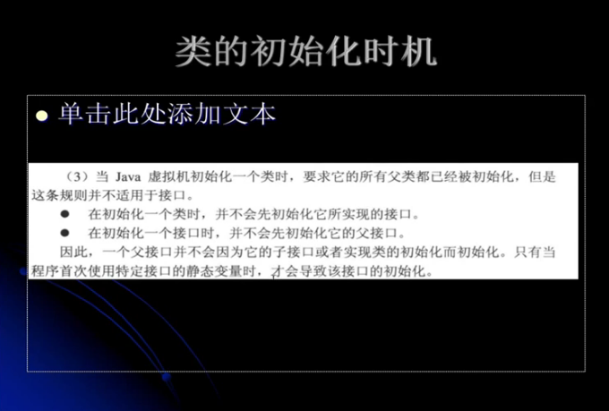

---
2019-08-16 16:57:27

---

#



## 第一个结论

由于接口interface的成员变量都是public static final来修饰的，所以如果不是编译期不能确定的值，都不会进行类加载，因为值都会被存到调用这个常量的方法所在的类中的常量池中，因此删除class并不影响。

而这里说的是初始化时机，是在调用接口的变量，才会导致该接口初始化。

这个案例不好演示，因为本身接口是不能放静态代码块的，所以初始化演示起来不好看到现象。

我们采用其他手段，比如新建一个匿名类（Thread），然后在实现体中，用实例代码块打印一句话：

代码：

```java
public class MyTest5 {

    public static void main(String[] args) {
        System.out.println(MyChild5.b);
        System.out.println("--------");
        System.out.println(MyParent5.thread);
    }

}

interface MyParent5 {
    public static final Thread thread = new Thread(){
        {
            System.out.println("MyParent5 invoked");
        }
    };
}

class MyChild5 implements MyParent5{
    public static int b = 5;
}
```

分析：

首先对MyChild5调用他的静态变量，这时候MyChild5会被初始化，如果说MyChild5是继承自另一个类，那么另一个类也会进行初始化，按照结论说的，实现接口并不会对接口进行初始化，只有到用到接口的静态变量才会进行对接口的初始化，那么我们期望看到的结果是：**加载三个接口类，MyParent5、MyChild5以及MyParent5$1表示MyParent5的一个匿名内部类，但是只有MyChild5进行了初始化，当输出------的之后，才对MyParent5进行初始化，然后由于实例化了Thread，所以会打印实例代码块的内容，也就是打印MyParent5 invoked，最后打印MyParent5.thread。**

输出：

```
......
[Loaded top.tomxwd.classloader.MyParent5 from file:/E:/IDEA-workspace/jvm-test-01/target/classes/]
[Loaded top.tomxwd.classloader.MyChild5 from file:/E:/IDEA-workspace/jvm-test-01/target/classes/]
......
[Loaded top.tomxwd.classloader.MyParent5$1 from file:/E:/IDEA-workspace/jvm-test-01/target/classes/]
......
5
--------
......
MyParent5 invoked
......
Thread[Thread-0,5,main]
```

如果把MyParent5改成class，那么在MyChild5初始化的时候，MyParent5会先进行初始化。

## 第二个结论

```java
public class MyTest5 {

    public static void main(String[] args) {
        System.out.println(MyParent5_1.thread);
    }

}
interface MyGrandpa5_1{
    public static final Thread thread = new Thread(){
        {
            System.out.println("MyGrandpa5_1 invoked");
        }
    };
}

interface MyParent5_1 extends MyGrandpa5_1{
    public static final Thread thread = new Thread(){
        {
            System.out.println("MyParent5_1 invoked");
        }
    };
}
```

结果输出：

```
[Loaded top.tomxwd.classloader.MyGrandpa5_1 from file:/E:/IDEA-workspace/jvm-test-01/target/classes/]
[Loaded top.tomxwd.classloader.MyParent5_1 from file:/E:/IDEA-workspace/jvm-test-01/target/classes/]
[Loaded top.tomxwd.classloader.MyGrandpa5_1$1 from file:/E:/IDEA-workspace/jvm-test-01/target/classes/]
[Loaded top.tomxwd.classloader.MyParent5_1$1 from file:/E:/IDEA-workspace/jvm-test-01/target/classes/]
MyParent5_1 invoked
Thread[Thread-0,5,main]
```

结果是**加载了但不对父类接口进行初始化**；