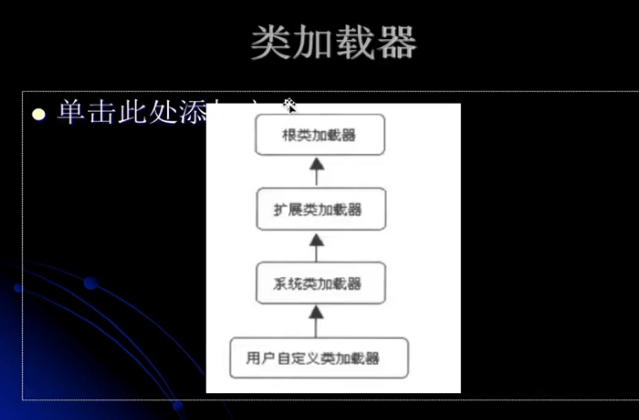
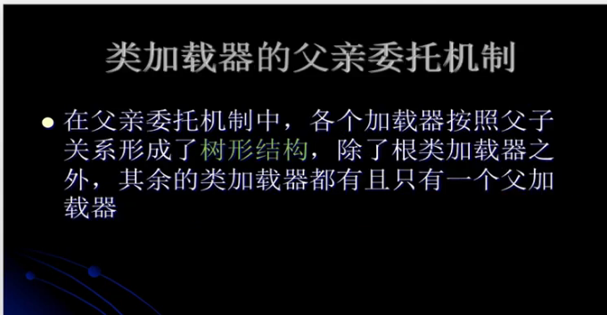
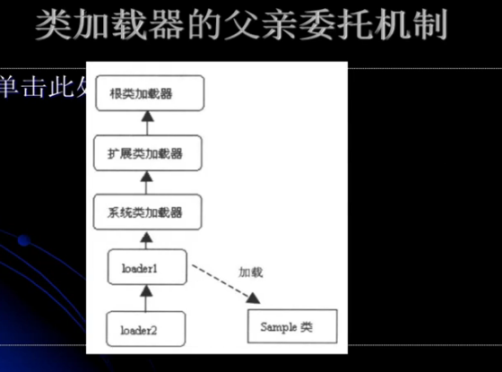
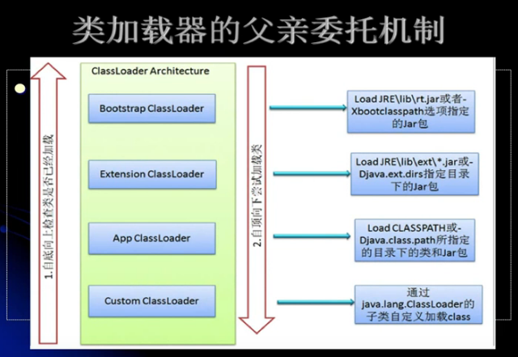
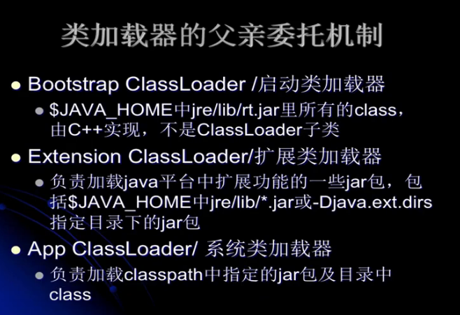
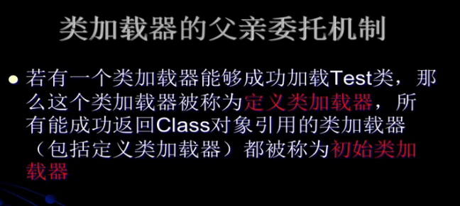

---
2019-08-19 09:10:45

---

# 









以上只是HotSpot的实现，其他的不能确定。

1. 自底向上检查类是否已经加载
2. 自顶向下尝试加载类






代码：

```java
public class MyTest7 {

    public static void main(String[] args) throws ClassNotFoundException {
        Class<?> clazz = Class.forName("java.lang.String");
        System.out.println(clazz.getClassLoader());
        Class<?> clazz2 = Class.forName("top.tomxwd.classloader.C");
        System.out.println(clazz2.getClassLoader());
    }

}

class C {

}
```

输出结果：

```
null
sun.misc.Launcher$AppClassLoader@58644d46
```

可以看getClassLoader方法的注释，如果是BootStrap启动器的话，这个方法会返回null，还有其他情况，看注释即可。

而类C是在类路径java.class.path（classpath）加载，所以是用AppClassLoader；