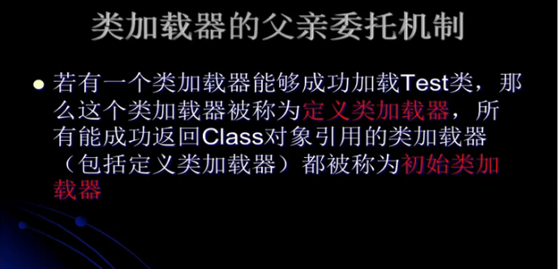
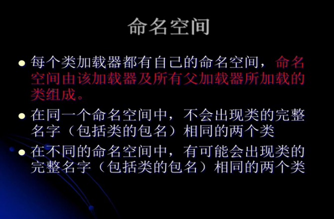

---
2019-08-20 09:48:07

---

#



由于我们自己定义的类加载器中使用的是类路径下的class文件，所以演示不出我们自己的类加载器进行加载的情况，所以需要改造一下方法以及加载形式。

代码：

```java
public class MyTest16 extends ClassLoader{

    private String classLoaderName;

    private final String fileExtension = ".class";

    private String path;

    public void setPath(String path) {
        this.path = path;
    }

    public MyTest16(String classLoaderName){
        /**
         * 使用由方法getSystemClassLoader()所返回的类加载器作为他的parentClassLoader（双亲）
         */
        super();
        this.classLoaderName = classLoaderName;
    }

    /**
     * 会使用指定的parent做为这个类加载器的双亲
     * @param parent
     * @param classLoaderName
     */
    public MyTest16(ClassLoader parent,String classLoaderName){
        super(parent);
        this.classLoaderName = classLoaderName;
    }

    @Override
    protected Class<?> findClass(String name) throws ClassNotFoundException {
        System.out.println("findClass invoked：" + name);
        System.out.println("Classloadername：" + this.classLoaderName);
        byte[] data = this.loadClassData(name);
        return this.defineClass(name,data,0,data.length);
    }

    /**
     * 这个name就是用户传进来需要被加载的类的名字（二进制名 全限定名）
     * @param name
     * @return
     */
    private byte[] loadClassData(String name){
        InputStream is = null;
        byte[] data = null;
        ByteArrayOutputStream baos = null;

        name = name.replace(".","\\");

        try{
            is = new FileInputStream(new File(this.path+name+this.fileExtension));
            baos = new ByteArrayOutputStream();
            int ch = 0;
            while (-1 != (ch=is.read())){
                baos.write(ch);
            }
            data = baos.toByteArray();
        } catch (Exception e){
            e.printStackTrace();
        } finally {
            try {
                is.close();
                baos.close();
            }catch (Exception e){
                e.printStackTrace();
            }
        }
        return data;
    }

    public static void main(String[] args) throws IllegalAccessException, InstantiationException, ClassNotFoundException {
        MyTest16 loader1 = new MyTest16("loader1");
//        loader1.setPath("E:\\IDEA-workspace\\jvm-test-01\\target\\classes\\");
        loader1.setPath("C:\\Users\\weidou.xie\\Desktop\\");
        Class<?> clazz = loader1.loadClass("top.tomxwd.classloader.MyTest1");
        System.out.println("clazz = " + clazz.hashCode());
        Object obj = clazz.newInstance();
        System.out.println("obj = " + obj);
        System.out.println("obj.getClass().getClassLoader() = " + obj.getClass().getClassLoader());
        System.out.println("----------------------------");
        MyTest16 loader2 = new MyTest16("loader2");
        loader2.setPath("C:\\Users\\weidou.xie\\Desktop\\");
        Class<?> clazz2 = loader1.loadClass("top.tomxwd.classloader.MyTest1");
        System.out.println("clazz2 = " + clazz2.hashCode());
        Object obj2 = clazz2.newInstance();
        System.out.println("obj2 = " + obj2);
        System.out.println("obj2.getClass().getClassLoader() = " + obj2.getClass().getClassLoader());
    }

}
```

**删除项目classes中的MyTest1.class文件，再运行。**

输出：

```
findClass invoked：top.tomxwd.classloader.MyTest1
Classloadername：loader1
clazz = 356573597
obj = top.tomxwd.classloader.MyTest1@677327b6
obj.getClass().getClassLoader() = top.tomxwd.classloader.MyTest16@4554617c
----------------------------
findClass invoked：top.tomxwd.classloader.MyTest1
Classloadername：loader2
clazz2 = 1836019240
obj2 = top.tomxwd.classloader.MyTest1@135fbaa4
obj2.getClass().getClassLoader() = top.tomxwd.classloader.MyTest16@14ae5a5
```

需要注，如果没有删除类路径下的MyTest1.class文件，则会发现还是应用类加载器在加载。

分析：

如果在类路径下已经有这个类了，那么会直接用应用类加载器加载。因为**双亲委托机制，而应用类加载器发现有这个类，那么就会进行加载**；

那么，如果用两个类加载器进行加载，而我们说**类只加载一次**，但是输出却显示两个class并不是同一个，这是为什么呢？难道是有矛盾，结论不对吗？其实不是，而是涉及到一个叫做命名空间的东西：

