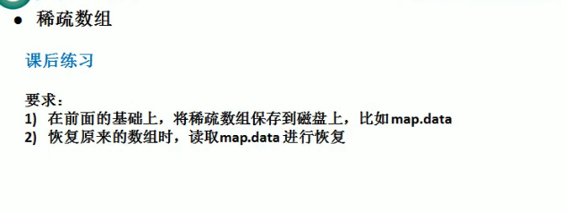

---
2019-07-24 10:20:12
---


```java
public class SparseArray {

    public static void main(String[] args) {
        // 创建一个原始的二维数组 11*11
        // 0 表示没有棋子
        // 1 表示黑子
        // 2 表示蓝子
        int[][] chessArr1 = new int[11][11];
        chessArr1[1][2] = 1;
        chessArr1[2][3] = 2;
        chessArr1[5][6] = 2;
        // 输出原始的二维数组
        System.out.println("原始的二维数组:");
        for (int[] row : chessArr1) {
            for (int data : row) {
                System.out.print(data+"\t");
            }
            System.out.println();
        }

        // 二维数组转稀疏数组的思想
        // 1.先遍历二维数组得到非0数据的个数
        int sum = 0;
        for (int i = 0; i < chessArr1.length; i++) {
            for (int j = 0; j < chessArr1[i].length; j++) {
                if( chessArr1[i][j] != 0){
                    sum++;
                }
            }
        }

        // 2.创建对应的稀疏数组
        int[][] sparseArr = new int[sum+1][3];
        // 第一行
        sparseArr[0][0] = 11;
        sparseArr[0][1] = 11;
        sparseArr[0][2] = sum;

        // 遍历二维数组，将非0值存放到稀疏数组中
        int count = 0;// count 用于记录第几个是非0数据
        for (int i = 0; i < chessArr1.length; i++) {
            for (int j = 0; j < chessArr1[i].length; j++) {
                if( chessArr1[i][j] != 0){
                    count++;
                    sparseArr[count][0] = i;
                    sparseArr[count][1] = j;
                    sparseArr[count][2] = chessArr1[i][j];

                }
            }
        }

        // 输出稀疏数组的形式
        System.out.println();
        System.out.println("得到的稀疏数组为：");
        for (int i = 0; i < sparseArr.length; i++) {
            System.out.printf("%d\t%d\t%d\t\n",sparseArr[i][0],sparseArr[i][1],sparseArr[i][2]);
        }

        // 将稀疏数组 恢复成 原始的二维数组
        // 1.先读取稀疏数组第一行数据
        int[][] chessArr2 = new int[sparseArr[0][0]][sparseArr[0][1]];

        // 2.读取稀疏数组后面数据(第二行开始)，赋值给二维数组
        for (int i = 1; i < sparseArr.length; i++) {
            chessArr2[sparseArr[i][0]][sparseArr[i][1]] = sparseArr[i][2];
        }


        // 恢复后的二维数组
        System.out.println();
        System.out.println("恢复后的二维数组：");
        for (int[] row : chessArr2) {
            for (int data : row) {
                System.out.print(data+"\t");
            }
            System.out.println();
        }


    }

}
```


课后题：

