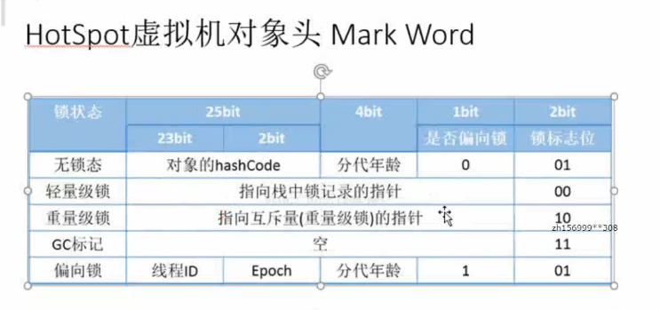

---
2019-08-02 16:43:02
---

对象的结构：

- Header（对象头）

  - 自身运行时数据（Mark Word）

    - 哈希值（native）
    - GC分代年龄
    - 锁状态标志
    - 线程持有的锁
    - 偏向线程ID
    - 偏向时间戳

    这里面占用的内存大小是根据虚拟机的位数决定的，32位、64位，而里面的数据远远大于32位，要如何进行存储？

    

  - 类型指针

- InstanceData（数据的实例）

  相同长度宽度的字段都会分配到一块

  - Long Double
  - short char

- Padding（占位符）
  - 对象的大小必须是八个字节的整数倍，如果对象没有对齐，就要用Padding进行填充。